# Academic Stakeholder Onboarding
## Research Excellence and Knowledge Translation for Evidence-Based Child Welfare

> **Mission**: Enable academic stakeholders to contribute rigorous research, evidence-based practice development, and knowledge translation that directly improves child welfare outcomes while advancing academic excellence and student development through meaningful social impact engagement.

---

## 🎓 Academic Onboarding Philosophy

### Research Excellence for Social Impact
Academic stakeholder engagement focuses on rigorous research that translates into improved child welfare:

```yaml
Academic Engagement Principles:
  Research Integrity: Highest standards of research ethics and methodology
  Evidence-Based Practice: Research that directly informs practice improvement
  Knowledge Translation: Bridge between academic research and practical application
  Student Development: Meaningful learning through real-world social impact
  
Academic Values Integration:
  Scientific Rigor: Methodologically sound research and evaluation
  Ethical Research: Protecting vulnerable populations in research
  Open Science: Transparent research practices and open access to findings
  Collaborative Knowledge: Cross-disciplinary and cross-sector collaboration
```

### Academic Sector Integration Model
Strategic framework for academic participation in penta-helix collaboration:

```mermaid
graph TD
    A[🎯 Academic Mission<br/>Research Excellence for Social Impact] --> B[🏛️ Universities<br/>Research Leadership]
    
    B --> C[📚 Research Institutes<br/>Specialized Knowledge]
    B --> D[👩‍🎓 Faculty Members<br/>Research and Teaching]
    B --> E[🎓 Students<br/>Learning and Service]
    B --> F[🏢 Professional Associations<br/>Knowledge Networks]
    
    C --> G[📊 Research Data Platform<br/>Secure Research Access]
    D --> G
    E --> G
    F --> G
    
    G --> H[🔬 Evidence-Based Practice Hub]
    H --> I[🌍 Knowledge Translation Network]
    
    I --> J[📈 Research Impact and Policy Influence]
    J --> K[👶 Evidence-Based Child Welfare Improvement]
    
    style A fill:#9B59B6
    style G fill:#F39C12
    style K fill:#27AE60
```



---

## 📋 5-Day Academic Onboarding Program

### Day 1: Research Ethics and Child Welfare Context

#### Morning Session: Research Ethics and Vulnerable Populations (4 hours)
```yaml
Session 1: Research Ethics with Children and Vulnerable Populations (90 minutes)
  Content Overview:
    - Ethical principles for research with children and vulnerable populations
    - Indonesian research ethics framework and regulatory requirements
    - Institutional Review Board (IRB) processes and approvals
    - Informed consent and assent procedures for children
    - Data protection and privacy requirements for sensitive populations
    
  Learning Objectives:
    - Apply ethical research principles to child welfare research
    - Navigate Indonesian research ethics approval processes
    - Develop appropriate consent and assent procedures
    - Implement data protection measures for vulnerable populations
    
  Interactive Activities:
    - Ethics case study analysis and discussion
    - IRB application preparation workshop
    - Consent form development exercise
    - Data protection protocol creation

Session 2: Indonesian Child Welfare Research Landscape (90 minutes)
  Content Overview:
    - Indonesian child welfare system and research priorities
    - Current research gaps and opportunities
    - Government research priorities and policy needs
    - International research collaboration opportunities
    - Research funding landscape for child welfare in Indonesia
    
  Learning Objectives:
    - Understand Indonesian child welfare research priorities
    - Identify research gaps and high-impact opportunities
    - Align research with government policy needs
    - Develop strategies for research funding and collaboration
    
  Interactive Activities:
    - Research landscape mapping exercise
    - Gap analysis and opportunity identification
    - Policy alignment assessment workshop
    - Funding strategy development session
```

#### Afternoon Session: MerajutASA Research Platform Introduction (4 hours)
```yaml
Session 3: Research Data Access and Platform Features (90 minutes)
  Content Overview:
    - MerajutASA research portal: research.merajutasa.id
    - Anonymized research data access protocols
    - Data security and ethical usage requirements
    - Research collaboration tools and features
    - Publication and dissemination support resources
    
  Learning Objectives:
    - Navigate research portal and access research data
    - Understand data security and ethical usage requirements
    - Use collaboration tools for research projects
    - Plan research publication and dissemination
    
  Interactive Activities:
    - Research portal guided tour and hands-on practice
    - Data access protocol setup and approval process
    - Collaboration tool configuration and usage
    - Publication planning workshop

Session 4: Evidence-Based Practice and Knowledge Translation (90 minutes)
  Content Overview:
    - Knowledge translation frameworks and methodologies
    - Evidence-based practice development and implementation
    - Research-practice partnership models
    - Community-based participatory research approaches
    - Policy influence through research translation
    
  Learning Objectives:
    - Apply knowledge translation frameworks effectively
    - Develop evidence-based practice recommendations
    - Build research-practice partnerships
    - Influence policy through research translation
    
  Interactive Activities:
    - Knowledge translation planning exercise
    - Evidence-based practice development workshop
    - Partnership development simulation
    - Policy brief writing and presentation practice
```

### Day 2: Research Methodology and Data Access

#### Morning Session: Research Design for Social Impact (4 hours)
```yaml
Session 5: Quantitative Research Methods for Child Welfare (90 minutes)
  Content Overview:
    - Experimental and quasi-experimental design for child welfare research
    - Survey methodology and measurement instrument development
    - Administrative data analysis and secondary data usage
    - Statistical analysis techniques for child welfare outcomes
    - Power analysis and sample size determination
    
  Learning Objectives:
    - Design rigorous quantitative research for child welfare
    - Develop valid and reliable measurement instruments
    - Analyze administrative and secondary data effectively
    - Apply appropriate statistical analysis techniques
    
  Interactive Activities:
    - Research design workshop with real child welfare questions
    - Measurement instrument development exercise
    - Statistical analysis hands-on practice
    - Power analysis and sample size calculation

Session 6: Qualitative Research Methods for Child Welfare (90 minutes)
  Content Overview:
    - Qualitative research design and methodology
    - Interview and focus group techniques with children and families
    - Observational research in child welfare settings
    - Narrative and case study approaches
    - Qualitative data analysis techniques and software
    
  Learning Objectives:
    - Design qualitative research appropriate for child welfare
    - Conduct interviews and focus groups with vulnerable populations
    - Apply observational research techniques ethically
    - Analyze qualitative data systematically and rigorously
    
  Interactive Activities:
    - Qualitative research design workshop
    - Interview technique practice and feedback
    - Data analysis software training (NVivo, Atlas.ti)
    - Case study development exercise
```

#### Afternoon Session: Mixed Methods and Evaluation Research (4 hours)
```yaml
Session 7: Mixed Methods Research Design (90 minutes)
  Content Overview:
    - Mixed methods research frameworks and designs
    - Sequential and concurrent mixed methods approaches
    - Integration strategies for quantitative and qualitative data
    - Pragmatic research philosophy and child welfare applications
    - Mixed methods analysis and interpretation techniques
    
  Learning Objectives:
    - Design appropriate mixed methods research for child welfare
    - Integrate quantitative and qualitative data effectively
    - Apply pragmatic research philosophy to social problems
    - Analyze and interpret mixed methods data comprehensively
    
  Interactive Activities:
    - Mixed methods design workshop
    - Data integration planning exercise
    - Analysis strategy development
    - Interpretation framework creation

Session 8: Program Evaluation and Impact Assessment (90 minutes)
  Content Overview:
    - Program evaluation theory and methodology
    - Impact evaluation design and implementation
    - Randomized controlled trials (RCTs) in child welfare
    - Cost-effectiveness and cost-benefit analysis
    - Evaluation utilization and stakeholder engagement
    
  Learning Objectives:
    - Design comprehensive program evaluations
    - Implement impact evaluation methodologies
    - Conduct economic evaluation of child welfare programs
    - Engage stakeholders in evaluation process and utilization
    
  Interactive Activities:
    - Evaluation design workshop for MerajutASA platform
    - Impact evaluation methodology selection exercise
    - Economic evaluation calculation practice
    - Stakeholder engagement planning session
```

### Day 3: Student Engagement and Experiential Learning

#### Morning Session: Student Research Integration (4 hours)
```yaml
Session 9: Student Research Project Development (90 minutes)
  Content Overview:
    - Student research project design and supervision
    - Undergraduate and graduate research opportunities
    - Student research ethics training and certification
    - Student research mentorship and support
    - Student research publication and presentation opportunities
    
  Learning Objectives:
    - Design meaningful student research projects
    - Provide effective research supervision and mentorship
    - Ensure student research ethics compliance
    - Support student research dissemination and professional development
    
  Interactive Activities:
    - Student research project design workshop
    - Mentorship strategy development
    - Ethics training curriculum design
    - Student support system planning

Session 10: Service Learning and Community Engagement (90 minutes)
  Content Overview:
    - Service learning pedagogy and implementation
    - Community engagement and partnership development
    - Student volunteer coordination and management
    - Reflection and learning integration techniques
    - Assessment and evaluation of service learning outcomes
    
  Learning Objectives:
    - Design effective service learning experiences
    - Develop community partnerships for student engagement
    - Coordinate student volunteer activities effectively
    - Assess service learning outcomes comprehensively
    
  Interactive Activities:
    - Service learning curriculum development workshop
    - Community partnership planning exercise
    - Student volunteer program design
    - Assessment framework development
```

#### Afternoon Session: Academic-Community Partnership (4 hours)
```yaml
Session 11: Community-Based Participatory Research (90 minutes)
  Content Overview:
    - CBPR principles and methodology
    - Community partnership development and maintenance
    - Power sharing and collaborative decision-making
    - Cultural competency and community respect
    - CBPR evaluation and sustainability
    
  Learning Objectives:
    - Implement community-based participatory research effectively
    - Develop authentic community partnerships
    - Share power and decision-making with community partners
    - Maintain cultural competency and community respect
    
  Interactive Activities:
    - CBPR project planning workshop
    - Community partnership agreement development
    - Power sharing protocol creation
    - Cultural competency assessment and planning

Session 12: Research-Practice Partnership Models (90 minutes)
  Content Overview:
    - Research-practice partnership development and management
    - Collaborative research design and implementation
    - Practitioner engagement and capacity building
    - Research utilization and implementation support
    - Sustained partnership maintenance and growth
    
  Learning Objectives:
    - Develop effective research-practice partnerships
    - Engage practitioners meaningfully in research process
    - Support research utilization and implementation
    - Maintain and grow research-practice partnerships over time
    
  Interactive Activities:
    - Partnership model design workshop
    - Practitioner engagement strategy development
    - Research utilization planning exercise
    - Partnership sustainability planning session
```

### Day 4: Knowledge Translation and Policy Influence

#### Morning Session: Knowledge Translation and Dissemination (4 hours)
```yaml
Session 13: Academic Publication and Peer Review (90 minutes)
  Content Overview:
    - Academic publication strategy and manuscript preparation
    - Peer review process and journal selection
    - Open access publishing and research sharing
    - Academic writing for different audiences
    - Publication ethics and integrity
    
  Learning Objectives:
    - Develop effective publication strategies
    - Prepare high-quality manuscripts for peer review
    - Navigate journal selection and submission processes
    - Write for diverse academic and practitioner audiences
    
  Interactive Activities:
    - Publication strategy development workshop
    - Manuscript preparation and review exercise
    - Journal selection criteria development
    - Academic writing workshop for different audiences

Session 14: Knowledge Translation to Practice and Policy (90 minutes)
  Content Overview:
    - Knowledge translation frameworks and strategies
    - Practice guideline development and implementation
    - Policy brief writing and advocacy
    - Media engagement and public communication
    - Stakeholder engagement in knowledge translation
    
  Learning Objectives:
    - Apply knowledge translation frameworks effectively
    - Develop practice guidelines from research evidence
    - Write compelling policy briefs and advocacy materials
    - Engage with media and communicate research to public
    
  Interactive Activities:
    - Knowledge translation strategy development
    - Practice guideline development workshop
    - Policy brief writing and presentation exercise
    - Media interview simulation and training
```

#### Afternoon Session: Research Impact and Evaluation (4 hours)
```yaml
Session 15: Research Impact Measurement and Evaluation (90 minutes)
  Content Overview:
    - Research impact frameworks and measurement
    - Citation analysis and bibliometric assessment
    - Social impact measurement and evaluation
    - Policy influence tracking and assessment
    - Long-term impact evaluation and documentation
    
  Learning Objectives:
    - Measure and evaluate research impact comprehensively
    - Use bibliometric tools and analysis effectively
    - Assess social impact of research activities
    - Track and document policy influence from research
    
  Interactive Activities:
    - Research impact measurement framework development
    - Bibliometric analysis hands-on practice
    - Social impact assessment exercise
    - Policy influence tracking system creation

Session 16: International Collaboration and Exchange (90 minutes)
  Content Overview:
    - International research collaboration development
    - Cross-cultural research considerations
    - International funding and partnership opportunities
    - Global research network participation
    - International conference presentation and networking
    
  Learning Objectives:
    - Develop international research collaborations
    - Navigate cross-cultural research considerations
    - Access international funding and partnership opportunities
    - Participate effectively in global research networks
    
  Interactive Activities:
    - International collaboration planning workshop
    - Cross-cultural research protocol development
    - Funding application strategy session
    - Conference presentation preparation and practice
```

### Day 5: Research Implementation and Sustainability

#### Morning Session: Research Implementation and Scaling (4 hours)
```yaml
Session 17: Research Implementation Science (90 minutes)
  Content Overview:
    - Implementation science frameworks and methodology
    - Evidence-based intervention adaptation and scaling
    - Implementation barrier identification and mitigation
    - Sustainability planning and maintenance
    - Implementation evaluation and continuous improvement
    
  Learning Objectives:
    - Apply implementation science frameworks to child welfare
    - Adapt and scale evidence-based interventions effectively
    - Identify and address implementation barriers
    - Plan for long-term sustainability of research-based interventions
    
  Interactive Activities:
    - Implementation science framework application workshop
    - Intervention adaptation planning exercise
    - Barrier analysis and mitigation strategy development
    - Sustainability planning session

Session 18: Research Program Development and Management (90 minutes)
  Content Overview:
    - Research program development and strategic planning
    - Research team building and management
    - Grant writing and funding acquisition
    - Research infrastructure development
    - Research program evaluation and improvement
    
  Learning Objectives:
    - Develop comprehensive research programs
    - Build and manage effective research teams
    - Write successful grant proposals and acquire funding
    - Develop research infrastructure and capacity
    
  Interactive Activities:
    - Research program strategic planning workshop
    - Team building and management simulation
    - Grant writing workshop with feedback
    - Infrastructure development planning exercise
```

#### Afternoon Session: Academic Leadership and Network Integration (4 hours)
```yaml
Session 19: Academic Leadership in Social Impact (90 minutes)
  Content Overview:
    - Academic leadership development and responsibilities
    - Social impact leadership in academic settings
    - Cross-sector leadership and collaboration
    - Academic institution change and innovation
    - Professional development and career advancement
    
  Learning Objectives:
    - Develop academic leadership skills and capabilities
    - Lead social impact initiatives in academic institutions
    - Collaborate effectively across sectors as academic leader
    - Drive change and innovation in academic institutions
    
  Interactive Activities:
    - Academic leadership development planning
    - Social impact initiative design workshop
    - Cross-sector collaboration leadership simulation
    - Change management planning exercise

Session 20: Graduation and Academic Network Integration (90 minutes)
  Content Overview:
    - Onboarding completion and certification
    - Academic stakeholder network integration
    - Ongoing learning and professional development
    - Academic sector contribution and leadership planning
    - Research collaboration commitment and celebration
    
  Learning Objectives:
    - Complete onboarding certification requirements
    - Integrate effectively into academic stakeholder network
    - Plan ongoing professional development and research agenda
    - Commit to academic sector leadership and contribution
    
  Interactive Activities:
    - Onboarding assessment and certification
    - Network integration planning and introductions
    - Research agenda development and goal setting
    - Collaboration commitment ceremony and celebration
```

---

## 🎯 Academic-Specific Platform Features

### Research Portal: research.merajutasa.id

#### Research Data Access and Management
```yaml
Data Access Features:
  Anonymized Research Database:
    - Secure access to anonymized child welfare data
    - Multi-level data access based on research approval
    - Real-time data availability and update notifications
    - Data quality assurance and documentation
    
  Research Ethics and Compliance:
    - Automated ethics approval workflow
    - Data usage monitoring and compliance tracking
    - Privacy protection and data security protocols
    - Research misconduct reporting and investigation
    
  Collaborative Research Tools:
    - Multi-institutional research collaboration platform
    - Shared research workspace and document management
    - Research protocol sharing and version control
    - Collaborative data analysis and interpretation tools
```

#### Knowledge Translation and Dissemination
```yaml
Publication and Dissemination Features:
  Research Publication Support:
    - Publication tracking and impact measurement
    - Open access publishing support and funding
    - Manuscript preparation and review assistance
    - Citation tracking and bibliometric analysis
    
  Knowledge Translation Tools:
    - Practice guideline development and dissemination
    - Policy brief creation and distribution
    - Research summary and infographic generation
    - Stakeholder communication and engagement tools
    
  Research Impact Measurement:
    - Academic impact tracking (citations, downloads, mentions)
    - Social impact measurement and evaluation
    - Policy influence tracking and documentation
    - Media coverage and public engagement monitoring
```

#### Student Engagement and Learning Platform
```yaml
Educational Features:
  Student Research Integration:
    - Student research project management and tracking
    - Research supervision and mentorship tools
    - Student research ethics training and certification
    - Student research presentation and competition platform
    
  Service Learning Coordination:
    - Service learning opportunity matching and placement
    - Student volunteer tracking and recognition
    - Reflection and learning documentation tools
    - Service learning assessment and evaluation
    
  Academic Career Development:
    - Academic career guidance and mentorship
    - Research skill development and training
    - Professional networking and collaboration opportunities
    - Academic job placement and advancement support
```

---

## 📊 Academic Success Metrics and Outcomes

### Individual Academic Stakeholder Success
```yaml
Research Excellence:
  Research Productivity: Publications, presentations, and grant funding secured
  Research Quality: Peer review ratings, citation impact, and research methodology rigor
  Knowledge Translation: Evidence-based practice guidelines and policy influence achieved
  Collaboration Effectiveness: Cross-sector partnerships and international collaborations developed
  
Student Development:
  Student Research Supervision: Number of students supervised and research projects completed
  Student Career Outcomes: Student career advancement and professional development
  Service Learning Impact: Student volunteer engagement and community service outcomes
  Student Satisfaction: Student evaluation of academic mentorship and guidance
```

### Academic Sector Collective Impact
```yaml
Research Contribution:
  Publication Output: XX research articles, book chapters, and reports published annually
  Research Funding: $X million in research funding secured for child welfare research
  Policy Influence: XX policy changes influenced by academic research
  International Recognition: Indonesian child welfare research recognized globally
  
Knowledge Translation:
  Evidence-Based Practice: XX evidence-based practices developed and implemented
  Practice Guidelines: XX practice guidelines developed and adopted
  Professional Training: XX practitioners trained in evidence-based approaches
  Policy Impact: XX government policies informed by academic research
```

### Child Welfare Research Impact
```yaml
Direct Child Welfare Improvement:
  Intervention Development: XX evidence-based interventions developed and tested
  Service Improvement: Measurable improvement in child welfare service quality
  System Innovation: XX system innovations developed and implemented
  Cost Effectiveness: Demonstrated cost-effectiveness of evidence-based approaches
  
Long-Term System Transformation:
  Research Culture: Evidence-based practice culture established in Indonesian child welfare
  Academic Infrastructure: Research infrastructure and capacity developed
  International Leadership: Indonesian child welfare research recognized as international model
  Sustainable Innovation: Continuous research and innovation pipeline established
```

---

## 🛠️ Academic-Specific Support Resources

### Research Support and Infrastructure
```yaml
Research Methodology Support:
  Statistical Consultation: Expert statistical analysis and methodology consultation
  Research Design Support: Assistance with research design and protocol development
  Data Analysis Training: Training on advanced data analysis techniques and software
  Research Ethics Support: Guidance on research ethics approval and compliance
  
Technical and Platform Support:
  Research Platform Training: Comprehensive training on research portal features
  Data Access Support: Assistance with data access approval and usage protocols
  Technology Support: Technical support for research tools and software
  Collaboration Platform: Support for research collaboration and communication tools
```

### Publication and Dissemination Support
```yaml
Publication Support:
  Writing Assistance: Professional editing and writing support for publications
  Journal Selection: Guidance on journal selection and submission strategies
  Open Access Support: Funding and support for open access publication
  Publication Ethics: Training and support on publication ethics and integrity
  
Knowledge Translation Support:
  Practice Guideline Development: Support for evidence-based practice guideline creation
  Policy Brief Writing: Professional assistance with policy brief development
  Media Training: Training on media engagement and public communication
  Stakeholder Engagement: Support for research stakeholder engagement and communication
```

### Student and Teaching Support
```yaml
Student Research Support:
  Student Supervision Training: Training on effective student research supervision
  Research Ethics Training: Student research ethics training and certification
  Student Funding: Research funding opportunities for student projects
  Student Career Development: Career guidance and professional development for students
  
Teaching and Curriculum Support:
  Curriculum Development: Support for child welfare curriculum development
  Service Learning: Assistance with service learning program development and implementation
  Teaching Resources: Access to teaching materials and resources
  Faculty Development: Professional development opportunities for faculty
```

---

## 📞 Academic Stakeholder Support and Contact

### Academic Research Team
```yaml
Academic Research Director:
  Email: research@merajutasa.id
  Phone: +62-21-XXXX-XXXX
  WhatsApp: +62-8XX-XXXX-XXXX
  Office Hours: Monday-Friday, 9 AM - 5 PM WIB
  
Research Data Manager:
  Email: data@merajutasa.id
  Phone: +62-21-XXXX-XXXX
  Response Time: 24 hours for data access requests, 4 hours for technical issues
  Data Access Support: Weekly data access consultation sessions available
  
Knowledge Translation Specialist:
  Email: knowledge@merajutasa.id
  Phone: +62-21-XXXX-XXXX
  Response Time: 48 hours for knowledge translation consultations
  Publication Support: Monthly publication strategy and support sessions
```

### Academic Community and Resources
```yaml
Academic Stakeholder Community:
  Research Portal: research.merajutasa.id
  Academic Forums: Active academic discussion and collaboration forums
  Resource Library: Academic resources, templates, and best practice guides
  Research Seminars: Regular research seminars and academic networking events
  
Professional Development:
  Academic Training Calendar: Regular training and development opportunities
  Research Skills Workshops: Specialized research methodology and analysis training
  International Exchange: Academic international collaboration and exchange opportunities
  Career Development: Academic career guidance and advancement support
```

### Research Collaboration and Funding
```yaml
Research Collaboration:
  Collaboration Matching: Academic-community-government research collaboration facilitation
  International Partnerships: Support for international research collaboration development
  Cross-Disciplinary Research: Facilitation of cross-disciplinary research teams
  Innovation Labs: Access to cross-sector innovation labs and co-creation opportunities
  
Research Funding and Support:
  Funding Opportunities: Regular updates on research funding opportunities
  Grant Writing Support: Professional grant writing assistance and training
  Research Infrastructure: Access to research infrastructure and shared resources
  Seed Funding: Small grant opportunities for innovative research projects
```

---

**Platform**: MerajutASA - Indonesian Child Welfare Platform  
**Research Portal**: research.merajutasa.id  
**Mission**: Evidence-based child welfare improvement through rigorous research  
**Focus**: Research excellence and knowledge translation for transformative social impact
