# Business Stakeholder Onboarding
## Corporate Partnership Excellence for Social Impact and Shared Value Creation

> **Mission**: Enable business stakeholders to create meaningful, sustainable partnerships that drive both social impact and business value through strategic corporate social responsibility, employee engagement, and innovative collaboration models within the MerajutASA ecosystem.

---

## 🏢 Business Onboarding Philosophy

### Shared Value Creation Through Social Impact
Business stakeholder engagement focuses on sustainable value creation for both business and society:

```yaml
Business Engagement Principles:
  Shared Value Creation: Business success and social impact are mutually reinforcing
  Authentic Partnership: Genuine commitment to child welfare beyond marketing
  Employee Engagement: Meaningful volunteer opportunities for employee development
  Innovation Collaboration: Co-creation of solutions for social challenges
  
Corporate Social Responsibility Values:
  Strategic Alignment: CSR initiatives aligned with business strategy and values
  Measurable Impact: Clear metrics for both social and business outcomes
  Long-term Commitment: Sustainable partnerships beyond short-term projects
  Stakeholder Integration: Engagement with all stakeholders in value creation
```

### Business Sector Integration Model
Strategic framework for business participation in penta-helix collaboration:

```mermaid
graph TD
    A[🎯 Business Mission<br/>Shared Value Creation] --> B[🏭 Large Corporations<br/>Strategic CSR Leadership]
    
    B --> C[🏢 Medium Enterprises<br/>Community Partnership]
    B --> D[🛒 Small Businesses<br/>Local Impact Creation]
    B --> E[🤝 Business Associations<br/>Sector Coordination]
    
    C --> F[📊 Business Impact Dashboard<br/>ROI and Social Impact Tracking]
    D --> F
    E --> F
    
    F --> G[👥 Employee Engagement Hub]
    G --> H[🔄 Cross-Sector Innovation Labs]
    
    H --> I[📈 Business and Social Outcomes]
    I --> J[👶 Enhanced Child Welfare Through Business]
    
    style A fill:#2ECC71
    style F fill:#F39C12
    style J fill:#27AE60
```



---

## 📋 5-Day Business Onboarding Program

### Day 1: Corporate Social Impact Foundation

#### Morning Session: Business Case for Social Impact (4 hours)
```yaml
Session 1: Strategic CSR and Shared Value Creation (90 minutes)
  Content Overview:
    - Evolution of corporate social responsibility to shared value
    - Business case for social impact investment
    - Indonesian business landscape and social responsibility expectations
    - Integration of ESG (Environmental, Social, Governance) frameworks
    - Competitive advantage through authentic social impact
    
  Learning Objectives:
    - Understand strategic approaches to corporate social responsibility
    - Identify opportunities for shared value creation
    - Develop business case for social impact investment
    - Align social impact with business strategy and values
    
  Interactive Activities:
    - Shared value mapping exercise for your organization
    - ROI calculation for social impact investments
    - Case study analysis: Successful corporate social impact initiatives
    - Business case development workshop

Session 2: Child Welfare Business Impact Opportunity (90 minutes)
  Content Overview:
    - Indonesian child welfare landscape and business opportunities
    - Corporate role in addressing child welfare challenges
    - Business benefits of child welfare investment
    - Brand reputation and stakeholder expectations
    - Employee engagement through child welfare initiatives
    
  Learning Objectives:
    - Understand business opportunities in child welfare sector
    - Identify ways business can contribute to child welfare improvement
    - Recognize brand and reputation benefits of child welfare investment
    - Plan employee engagement through child welfare activities
    
  Interactive Activities:
    - Child welfare opportunity assessment for your industry
    - Brand impact analysis and planning exercise
    - Employee engagement strategy development
    - Stakeholder expectation mapping
```

#### Afternoon Session: MerajutASA Business Platform Introduction (4 hours)
```yaml
Session 3: Business Portal and Partnership Opportunities (90 minutes)
  Content Overview:
    - MerajutASA business portal: business.merajutasa.id
    - Corporate partnership models and opportunities
    - Employee volunteer management system
    - Corporate giving and donation management
    - Brand partnership and co-marketing opportunities
    
  Learning Objectives:
    - Navigate business portal effectively
    - Understand available partnership models
    - Plan employee volunteer program implementation
    - Develop corporate giving strategy
    
  Interactive Activities:
    - Business portal guided tour and hands-on practice
    - Partnership model selection and planning exercise
    - Employee volunteer program design workshop
    - Corporate giving strategy development

Session 4: Impact Measurement and ROI Tracking (90 minutes)
  Content Overview:
    - Social Return on Investment (SROI) methodology
    - Business impact measurement frameworks
    - Real-time impact tracking and reporting
    - Brand reputation and employee satisfaction metrics
    - Stakeholder communication and transparency
    
  Learning Objectives:
    - Implement SROI measurement for social impact initiatives
    - Track business outcomes from social impact investments
    - Monitor and report on impact metrics effectively
    - Communicate impact to stakeholders transparently
    
  Interactive Activities:
    - SROI calculation workshop for sample initiatives
    - Impact measurement framework development
    - Dashboard configuration and hands-on practice
    - Stakeholder communication planning exercise
```

### Day 2: Partnership Development and Management

#### Morning Session: Strategic Partnership Development (4 hours)
```yaml
Session 5: Corporate Partnership Strategy (90 minutes)
  Content Overview:
    - Partnership strategy development and alignment
    - Due diligence and partner selection criteria
    - Partnership agreement development and negotiation
    - Risk management and partnership governance
    - Partnership lifecycle management and renewal
    
  Learning Objectives:
    - Develop comprehensive partnership strategies
    - Conduct effective due diligence and partner selection
    - Negotiate partnership agreements that create mutual value
    - Manage partnership risks and governance effectively
    
  Interactive Activities:
    - Partnership strategy development workshop
    - Due diligence checklist creation and practice
    - Partnership agreement drafting exercise
    - Risk assessment and management planning

Session 6: Cross-Sector Collaboration and Innovation (90 minutes)
  Content Overview:
    - Multi-stakeholder collaboration strategies
    - Innovation co-creation with government, academia, and community
    - Technology transfer and knowledge sharing
    - Innovation pipeline development and management
    - Intellectual property and collaboration agreements
    
  Learning Objectives:
    - Lead and participate in cross-sector collaboration effectively
    - Co-create innovative solutions with diverse stakeholders
    - Manage technology transfer and knowledge sharing
    - Develop sustainable innovation partnerships
    
  Interactive Activities:
    - Cross-sector collaboration simulation
    - Innovation co-creation workshop
    - Technology transfer planning exercise
    - Innovation partnership development
```

#### Afternoon Session: Corporate Giving and Resource Mobilization (4 hours)
```yaml
Session 7: Strategic Corporate Giving (90 minutes)
  Content Overview:
    - Corporate philanthropy strategy and best practices
    - Giving models: cash donations, in-kind support, pro bono services
    - Employee giving and matching programs
    - Corporate foundation development and management
    - Tax optimization and legal compliance for corporate giving
    
  Learning Objectives:
    - Develop strategic approach to corporate philanthropy
    - Implement diverse giving models effectively
    - Engage employees in giving and volunteer programs
    - Optimize tax benefits and ensure legal compliance
    
  Interactive Activities:
    - Corporate giving strategy development workshop
    - Giving model selection and implementation planning
    - Employee giving program design exercise
    - Legal compliance and tax optimization planning

Session 8: Resource Mobilization and Fundraising Leadership (90 minutes)
  Content Overview:
    - Corporate leadership in resource mobilization
    - Business network leveraging for fundraising
    - Corporate event planning and execution
    - Peer-to-peer fundraising and advocacy
    - Corporate foundation grant-making and evaluation
    
  Learning Objectives:
    - Lead resource mobilization initiatives effectively
    - Leverage business networks for fundraising success
    - Plan and execute successful corporate fundraising events
    - Develop grant-making and evaluation capabilities
    
  Interactive Activities:
    - Resource mobilization strategy development
    - Network mapping and engagement planning
    - Corporate event planning workshop
    - Grant-making framework development
```

### Day 3: Employee Engagement and Volunteer Management

#### Morning Session: Employee Volunteer Program Excellence (4 hours)
```yaml
Session 9: Employee Volunteer Program Design (90 minutes)
  Content Overview:
    - Employee volunteer program strategy and design
    - Volunteer opportunity matching and placement
    - Skills-based volunteering and pro bono services
    - Team building through volunteer activities
    - Employee volunteer recognition and rewards
    
  Learning Objectives:
    - Design comprehensive employee volunteer programs
    - Match employee skills with volunteer opportunities effectively
    - Implement skills-based volunteering and pro bono services
    - Use volunteering for team building and employee development
    
  Interactive Activities:
    - Employee volunteer program design workshop
    - Skills assessment and opportunity matching exercise
    - Team building activity planning
    - Recognition and rewards program development

Session 10: Employee Engagement and Development (90 minutes)
  Content Overview:
    - Employee engagement through social impact
    - Professional development through volunteer activities
    - Leadership development and career advancement
    - Work-life integration and employee satisfaction
    - Employee retention and recruitment through social impact
    
  Learning Objectives:
    - Engage employees meaningfully through social impact activities
    - Provide professional development through volunteer opportunities
    - Support leadership development through social impact initiatives
    - Improve employee satisfaction and retention through social engagement
    
  Interactive Activities:
    - Employee engagement strategy development
    - Professional development pathway mapping
    - Leadership development program design
    - Employee satisfaction improvement planning
```

#### Afternoon Session: Volunteer Management and Coordination (4 hours)
```yaml
Session 11: Volunteer Management Best Practices (90 minutes)
  Content Overview:
    - Volunteer recruitment and orientation strategies
    - Volunteer training and skill development
    - Volunteer coordination and project management
    - Volunteer performance management and feedback
    - Volunteer retention and long-term engagement
    
  Learning Objectives:
    - Implement effective volunteer recruitment and orientation
    - Provide comprehensive volunteer training and development
    - Coordinate volunteer activities and projects effectively
    - Manage volunteer performance and provide meaningful feedback
    
  Interactive Activities:
    - Volunteer recruitment strategy development
    - Training program design workshop
    - Project coordination simulation
    - Performance management system development

Session 12: Technology-Enhanced Volunteer Coordination (90 minutes)
  Content Overview:
    - Volunteer management platform features and usage
    - Digital volunteer tracking and reporting
    - Virtual volunteering and remote engagement
    - Mobile app usage for volunteer coordination
    - Data analytics for volunteer program optimization
    
  Learning Objectives:
    - Use technology platforms for volunteer management effectively
    - Track and report on volunteer activities and impact
    - Coordinate virtual and remote volunteer activities
    - Optimize volunteer programs using data analytics
    
  Interactive Activities:
    - Platform configuration hands-on practice
    - Digital tracking system setup
    - Virtual volunteering program design
    - Analytics dashboard creation and usage
```

### Day 4: Brand Integration and Marketing Collaboration

#### Morning Session: Authentic Brand Integration (4 hours)
```yaml
Session 13: Brand Purpose and Social Impact Alignment (90 minutes)
  Content Overview:
    - Brand purpose development and articulation
    - Social impact integration with brand strategy
    - Authentic storytelling and communication
    - Brand reputation management through social impact
    - Consumer engagement and loyalty through purpose
    
  Learning Objectives:
    - Develop authentic brand purpose aligned with social impact
    - Integrate social impact naturally into brand strategy
    - Communicate social impact authentically and compellingly
    - Build brand reputation through genuine social impact
    
  Interactive Activities:
    - Brand purpose definition workshop
    - Social impact integration strategy development
    - Authentic storytelling exercise
    - Brand reputation management planning

Session 14: Marketing Collaboration and Co-Branding (90 minutes)
  Content Overview:
    - Co-marketing opportunities and partnerships
    - Brand collaboration guidelines and best practices
    - Joint marketing campaign development and execution
    - Thought leadership and content collaboration
    - Event partnership and co-hosting opportunities
    
  Learning Objectives:
    - Develop effective co-marketing partnerships
    - Create joint marketing campaigns that benefit all parties
    - Establish thought leadership through content collaboration
    - Plan and execute successful event partnerships
    
  Interactive Activities:
    - Co-marketing opportunity identification
    - Joint campaign development workshop
    - Content collaboration planning
    - Event partnership design exercise
```

#### Afternoon Session: Communications and Public Relations (4 hours)
```yaml
Session 15: Corporate Communications for Social Impact (90 minutes)
  Content Overview:
    - Corporate communication strategy for social impact
    - Media relations and press release development
    - Social media strategy and content creation
    - Crisis communication and reputation management
    - Stakeholder communication and engagement
    
  Learning Objectives:
    - Develop comprehensive communication strategy for social impact
    - Manage media relations and create compelling press materials
    - Implement effective social media strategies
    - Prepare for crisis communication and reputation management
    
  Interactive Activities:
    - Communication strategy development workshop
    - Press release writing exercise
    - Social media content creation workshop
    - Crisis communication simulation

Session 16: Thought Leadership and Industry Influence (90 minutes)
  Content Overview:
    - Thought leadership development and positioning
    - Industry influence and advocacy strategies
    - Conference speaking and presentation skills
    - White paper and research publication
    - Industry association leadership and participation
    
  Learning Objectives:
    - Establish thought leadership in social impact space
    - Influence industry standards and practices
    - Develop effective presentation and speaking skills
    - Contribute to industry knowledge through research and publication
    
  Interactive Activities:
    - Thought leadership strategy development
    - Industry influence planning workshop
    - Presentation skills practice and feedback
    - Research collaboration planning
```

### Day 5: Implementation and Sustainability Planning

#### Morning Session: Implementation Roadmap and Project Management (4 hours)
```yaml
Session 17: Corporate Social Impact Implementation (90 minutes)
  Content Overview:
    - Implementation roadmap development and planning
    - Project management for social impact initiatives
    - Budget development and resource allocation
    - Timeline creation and milestone setting
    - Risk management and contingency planning
    
  Learning Objectives:
    - Develop comprehensive implementation roadmaps
    - Apply project management best practices to social impact
    - Plan budgets and allocate resources effectively
    - Set realistic timelines and meaningful milestones
    
  Interactive Activities:
    - Implementation roadmap creation workshop
    - Project management simulation
    - Budget development and resource planning
    - Risk assessment and mitigation planning

Session 18: Organizational Change and Integration (90 minutes)
  Content Overview:
    - Change management for social impact integration
    - Organizational culture development and evolution
    - Leadership engagement and buy-in strategies
    - Employee communication and engagement
    - Performance measurement and accountability systems
    
  Learning Objectives:
    - Implement organizational change for social impact integration
    - Develop organizational culture that supports social impact
    - Engage leadership and build buy-in for social impact initiatives
    - Create accountability systems for social impact performance
    
  Interactive Activities:
    - Change management plan development
    - Culture development strategy workshop
    - Leadership engagement planning
    - Accountability system design
```

#### Afternoon Session: Sustainability and Growth Planning (4 hours)
```yaml
Session 19: Partnership Sustainability and Growth (90 minutes)
  Content Overview:
    - Long-term partnership sustainability strategies
    - Growth planning and scaling initiatives
    - Innovation and continuous improvement
    - Succession planning and leadership development
    - Performance evaluation and optimization
    
  Learning Objectives:
    - Develop strategies for long-term partnership sustainability
    - Plan for growth and scaling of social impact initiatives
    - Foster innovation and continuous improvement
    - Prepare succession plans and develop leadership capabilities
    
  Interactive Activities:
    - Sustainability strategy development workshop
    - Growth planning and scaling exercise
    - Innovation planning session
    - Leadership development and succession planning

Session 20: Graduation and Business Network Integration (90 minutes)
  Content Overview:
    - Onboarding completion and certification
    - Business stakeholder network integration
    - Ongoing learning and development opportunities
    - Business sector leadership and contribution planning
    - Celebration and recognition ceremony
    
  Learning Objectives:
    - Complete onboarding certification requirements
    - Integrate effectively into business stakeholder network
    - Plan ongoing professional development and learning
    - Commit to business sector leadership and contribution
    
  Interactive Activities:
    - Onboarding assessment and certification
    - Network integration planning
    - Professional development goal setting
    - Leadership commitment ceremony
```

---

## 🎯 Business-Specific Platform Features

### Business Portal: business.merajutasa.id

#### Corporate Partnership Management Dashboard
```yaml
Partnership Features:
  Partnership Portfolio Management:
    - Comprehensive partnership tracking and management
    - Partnership performance monitoring and evaluation
    - Partnership lifecycle management and renewal tracking
    - Collaborative partnership planning and goal setting
    
  Corporate Giving Management:
    - Donation tracking and impact measurement
    - Employee giving program management
    - In-kind donation coordination and tracking
    - Tax optimization and compliance reporting
    
  Employee Engagement Platform:
    - Employee volunteer opportunity matching
    - Volunteer hour tracking and recognition
    - Skills-based volunteering coordination
    - Employee social impact profile management
```

#### Business Impact Measurement and Analytics
```yaml
ROI and Impact Analytics:
  Social Return on Investment (SROI):
    - Real-time SROI calculation and tracking
    - Impact attribution and contribution analysis
    - Comparative analysis across initiatives
    - Predictive modeling for future impact
    
  Business Outcome Tracking:
    - Brand reputation and sentiment monitoring
    - Employee satisfaction and retention metrics
    - Customer loyalty and engagement analysis
    - Market positioning and competitive advantage tracking
    
  ESG Reporting and Compliance:
    - ESG framework integration and reporting
    - Sustainability reporting automation
    - Stakeholder reporting and transparency tools
    - Regulatory compliance monitoring and reporting
```

#### Innovation and Collaboration Hub
```yaml
Innovation Platform Features:
  Cross-Sector Innovation Labs:
    - Multi-stakeholder innovation project coordination
    - Innovation challenge design and management
    - Intellectual property and collaboration agreements
    - Innovation pipeline tracking and evaluation
    
  Business Network Collaboration:
    - Business-to-business partnership facilitation
    - Industry collaboration and coordination
    - Supply chain integration and optimization
    - Market development and expansion opportunities
    
  Technology and Knowledge Transfer:
    - Technology sharing and transfer coordination
    - Best practice documentation and sharing
    - Knowledge management and organizational learning
    - Innovation scaling and replication support
```

---

## 📊 Business Success Metrics and Outcomes

### Individual Business Stakeholder Success
```yaml
Knowledge and Competency:
  Social Impact Expertise: >95% completion of business social impact training
  Partnership Management Skills: >90% competency in partnership development and management
  Employee Engagement Skills: >85% effectiveness rating in employee volunteer program management
  Innovation Collaboration: >90% proficiency in cross-sector innovation collaboration
  
Performance and Contribution:
  Partnership Implementation: Successful implementation of at least one strategic partnership
  Employee Engagement: >80% employee participation in volunteer or giving programs
  Innovation Leadership: Leadership or participation in at least one innovation initiative
  Network Integration: Active participation in business stakeholder network and industry leadership
```

### Business Sector Collective Impact
```yaml
Corporate Social Impact:
  Partnership Portfolio: $X million in corporate social impact investment through platform
  Employee Engagement: X,000+ employees engaged in volunteer and giving programs
  Innovation Development: XX successful cross-sector innovation projects launched
  Brand Integration: 100% of participating businesses integrate social impact into brand strategy
  
Economic and Social Value:
  Shared Value Creation: X:1 ratio of social impact to business investment
  Employee Satisfaction: 40% improvement in employee satisfaction among participating companies
  Brand Reputation: 30% improvement in brand reputation metrics for participating businesses
  Market Advantage: 25% competitive advantage gain through authentic social impact integration
```

### Child Welfare Business Impact
```yaml
Direct Child Welfare Contribution:
  Financial Investment: $X million annual business investment in child welfare
  Volunteer Contribution: X,000+ volunteer hours contributed to child welfare initiatives
  Innovation Solutions: XX innovative solutions developed for child welfare challenges
  Policy Influence: Business advocacy contributing to XX policy improvements for children
  
Long-Term System Impact:
  Sustainable Partnerships: XX% of business partnerships continuing beyond 5 years
  Sector Transformation: Business sector leadership in Indonesian child welfare recognized internationally
  Innovation Pipeline: Continuous innovation pipeline addressing child welfare challenges
  Economic Development: Local economic development through business engagement in child welfare
```

---

## 🛠️ Business-Specific Support Resources

### Corporate Partnership Support
```yaml
Partnership Development Support:
  Partnership Strategy Consulting: Expert guidance on partnership strategy development
  Due Diligence Support: Assistance with partner evaluation and selection
  Legal and Contract Support: Legal expertise for partnership agreements and compliance
  Partnership Management: Ongoing support for partnership management and optimization
  
Corporate Giving and Philanthropy Support:
  Giving Strategy Development: Expert guidance on corporate philanthropy strategy
  Tax Optimization: Professional advice on tax benefits and legal compliance
  Foundation Development: Support for corporate foundation establishment and management
  Grant-Making Excellence: Training and support for effective grant-making
```

### Employee Engagement and Development
```yaml
Employee Program Support:
  Volunteer Program Design: Expert assistance with employee volunteer program development
  Training and Development: Comprehensive training programs for employee engagement
  Technology Platform Support: Support for employee engagement platform implementation
  Performance Measurement: Tools and support for measuring employee engagement outcomes
  
Professional Development:
  Business Leadership Training: Leadership development programs for business social impact leaders
  Innovation Training: Training on innovation and co-creation methodologies
  Communication Skills: Training on authentic communication and storytelling for social impact
  Network Building: Facilitation of business professional networks and peer learning
```

### Brand and Marketing Support
```yaml
Brand Integration Support:
  Brand Strategy Consulting: Expert guidance on brand purpose and social impact integration
  Marketing Collaboration: Support for co-marketing and collaborative marketing initiatives
  Content Creation: Professional support for content creation and storytelling
  Reputation Management: Support for brand reputation management through social impact
  
Communications and Public Relations:
  Communications Strategy: Expert guidance on corporate communications for social impact
  Media Relations: Support for media relations and public relations activities
  Thought Leadership: Support for establishing thought leadership in social impact space
  Crisis Communication: Preparation and support for crisis communication and reputation management
```

---

## 📞 Business Stakeholder Support and Contact

### Business Partnership Team
```yaml
Business Partnership Manager:
  Email: business@merajutasa.id
  Phone: +62-21-XXXX-XXXX
  WhatsApp: +62-8XX-XXXX-XXXX
  Office Hours: Monday-Friday, 8 AM - 6 PM WIB
  
Corporate Engagement Specialist:
  Email: corporate@merajutasa.id
  Phone: +62-21-XXXX-XXXX
  Response Time: 4 hours for partnership inquiries, 24 hours for general questions
  Emergency Support: 24/7 support for critical business partnership issues
  
Innovation and Strategy Consultant:
  Email: innovation@merajutasa.id
  Phone: +62-21-XXXX-XXXX
  Response Time: 48 hours for innovation consultations, 4 hours for urgent strategy questions
  Expert Consultation: Weekly innovation strategy consultation sessions available
```

### Business Community and Resources
```yaml
Business Stakeholder Community:
  Business Portal: business.merajutasa.id
  Discussion Forums: Active business stakeholder discussion and collaboration
  Resource Library: Business-specific resources, templates, and best practice guides
  Networking Events: Regular business stakeholder networking and learning events
  
Professional Development:
  Business Training Calendar: Regular training and development opportunities for business leaders
  Innovation Showcases: Business innovation recognition and celebration events
  Thought Leadership: Business thought leadership development and platform opportunities
  International Exchange: Business international learning and partnership opportunities
```

### Investment and Partnership Opportunities
```yaml
Strategic Investment:
  Investment Opportunities: Structured investment opportunities in child welfare innovation
  Partnership Tiers: Multiple partnership levels to accommodate different business sizes and capabilities
  Co-Investment: Opportunities for co-investment with other businesses and sectors
  Impact Bonds: Social impact bond opportunities for measurable outcome investment
  
Corporate Development:
  Market Expansion: Opportunities for market expansion through social impact partnerships
  Supply Chain Integration: Supply chain optimization through social impact integration
  Customer Engagement: Customer engagement opportunities through authentic social impact
  Competitive Advantage: Sustainable competitive advantage development through social impact leadership
```

---

**Platform**: MerajutASA - Indonesian Child Welfare Platform  
**Business Portal**: business.merajutasa.id  
**Mission**: Shared value creation through authentic social impact partnership  
**Focus**: Sustainable business success through transformative child welfare contribution
