# Community Stakeholder Onboarding
## Grassroots Engagement and Volunteer Excellence for Sustainable Child Welfare

> **Mission**: Empower community stakeholders to create sustainable, grassroots support systems for vulnerable children through volunteer coordination, local resource mobilization, and community-driven innovation that strengthens the social fabric around orphanages and child welfare services.

---

## 👥 Community Onboarding Philosophy

### Grassroots Empowerment for Child Welfare
Community stakeholder engagement focuses on building local capacity and sustainable support:

```yaml
Community Engagement Principles:
  Grassroots Leadership: Community-driven solutions and local ownership
  Inclusive Participation: Welcoming all community members regardless of background
  Cultural Respect: Honoring local traditions and community wisdom
  Sustainable Impact: Building lasting community support systems
  
Indonesian Community Values:
  Gotong Royong: Collaborative community spirit and mutual assistance
  Kebersamaan: Unity and togetherness in community action
  Kepedulian: Care and concern for vulnerable community members
  Keberlanjutan: Sustainable community development and long-term thinking
```

### Community Sector Integration Model
Strategic framework for community participation in penta-helix collaboration:

```mermaid
graph TD
    A[🎯 Community Mission<br/>Grassroots Child Welfare Support] --> B[🏘️ Local Communities<br/>Neighborhood Engagement]
    
    B --> C[🙏 Religious Organizations<br/>Faith-Based Support]
    B --> D[🤝 NGOs and CBOs<br/>Organized Community Action]
    B --> E[👤 Individual Volunteers<br/>Personal Contribution]
    B --> F[👑 Community Leaders<br/>Traditional and Modern Leadership]
    
    C --> G[📱 Community Platform<br/>Volunteer Coordination Hub]
    D --> G
    E --> G
    F --> G
    
    G --> H[🌟 Local Resource Mobilization]
    H --> I[🔄 Community Innovation Labs]
    
    I --> J[📈 Sustainable Community Support]
    J --> K[👶 Community-Centered Child Welfare]
    
    style A fill:#E67E22
    style G fill:#F39C12
    style K fill:#27AE60
```



---

## 📋 5-Day Community Onboarding Program

### Day 1: Community Foundation and Child Welfare Context

#### Morning Session: Indonesian Community Structure and Child Welfare (4 hours)
```yaml
Session 1: Indonesian Community Organization and Leadership (90 minutes)
  Content Overview:
    - Traditional Indonesian community structure (RT, RW, Desa)
    - Role of traditional leaders (Tokoh Masyarakat) in community development
    - Religious organizations and faith-based community support
    - Modern community organizations and NGOs
    - Youth organizations and student volunteer groups
    
  Learning Objectives:
    - Understand Indonesian community structure and dynamics
    - Identify key community leaders and influencers
    - Navigate traditional and modern community organizations
    - Build relationships across diverse community groups
    
  Interactive Activities:
    - Community mapping exercise for local area
    - Leadership identification and relationship building workshop
    - Community organization role-play and networking
    - Traditional and modern leadership integration planning

Session 2: Community-Based Child Welfare and Protection (90 minutes)
  Content Overview:
    - Community role in child protection and welfare
    - Traditional Indonesian child-rearing and community support
    - Community response to child vulnerability and crisis
    - Religious and cultural approaches to child welfare
    - Community-based child protection networks
    
  Learning Objectives:
    - Understand community's role in child welfare system
    - Appreciate traditional and cultural approaches to child protection
    - Identify community resources for child welfare support
    - Develop community-based child protection strategies
    
  Interactive Activities:
    - Community child welfare resource mapping
    - Traditional practice analysis and respect integration
    - Community protection network design exercise
    - Cultural competency assessment and development
```

#### Afternoon Session: MerajutASA Community Platform Introduction (4 hours)
```yaml
Session 3: Community Portal and Volunteer Coordination (90 minutes)
  Content Overview:
    - MerajutASA community portal: community.merajutasa.id
    - Volunteer opportunity matching and placement system
    - Community event coordination and management
    - Local fundraising and resource mobilization tools
    - Community storytelling and impact sharing features
    
  Learning Objectives:
    - Navigate community portal effectively
    - Use volunteer matching and coordination tools
    - Organize community events and activities
    - Mobilize local resources and coordinate fundraising
    
  Interactive Activities:
    - Community portal guided tour and hands-on practice
    - Volunteer profile creation and opportunity matching
    - Event planning and coordination exercise
    - Fundraising strategy development workshop

Session 4: Community Engagement and Network Building (90 minutes)
  Content Overview:
    - Community engagement strategies and best practices
    - Volunteer recruitment and retention techniques
    - Community partnership development and maintenance
    - Conflict resolution and community mediation
    - Community capacity building and leadership development
    
  Learning Objectives:
    - Engage community members effectively
    - Recruit and retain dedicated volunteers
    - Build and maintain community partnerships
    - Resolve conflicts and mediate community disputes
    
  Interactive Activities:
    - Community engagement strategy development
    - Volunteer recruitment campaign planning
    - Partnership agreement creation and negotiation
    - Conflict resolution simulation and mediation practice
```

### Day 2: Volunteer Management and Coordination

#### Morning Session: Volunteer Program Development (4 hours)
```yaml
Session 5: Volunteer Recruitment and Orientation (90 minutes)
  Content Overview:
    - Volunteer recruitment strategies for diverse communities
    - Volunteer screening and background check procedures
    - Volunteer orientation and onboarding processes
    - Volunteer skills assessment and placement
    - Volunteer safety and child protection training
    
  Learning Objectives:
    - Develop effective volunteer recruitment strategies
    - Implement appropriate volunteer screening procedures
    - Design comprehensive volunteer orientation programs
    - Match volunteer skills with appropriate opportunities
    
  Interactive Activities:
    - Volunteer recruitment campaign design workshop
    - Screening procedure development and practice
    - Orientation curriculum creation exercise
    - Skills assessment tool development

Session 6: Volunteer Training and Development (90 minutes)
  Content Overview:
    - Volunteer training program design and implementation
    - Child protection and safeguarding training for volunteers
    - Cultural competency and sensitivity training
    - Communication and interpersonal skills development
    - Specialized skills training for specific volunteer roles
    
  Learning Objectives:
    - Design comprehensive volunteer training programs
    - Implement child protection training for all volunteers
    - Develop cultural competency among volunteers
    - Provide ongoing skills development opportunities
    
  Interactive Activities:
    - Training curriculum development workshop
    - Child protection training simulation
    - Cultural competency assessment and training design
    - Skills development pathway creation
```

#### Afternoon Session: Volunteer Coordination and Management (4 hours)
```yaml
Session 7: Volunteer Coordination and Scheduling (90 minutes)
  Content Overview:
    - Volunteer scheduling and coordination systems
    - Task assignment and project management
    - Volunteer communication and coordination protocols
    - Volunteer performance monitoring and feedback
    - Volunteer recognition and appreciation programs
    
  Learning Objectives:
    - Coordinate volunteer activities efficiently
    - Manage volunteer schedules and assignments effectively
    - Provide regular feedback and performance support
    - Recognize and appreciate volunteer contributions
    
  Interactive Activities:
    - Volunteer coordination system design
    - Scheduling and assignment practice
    - Performance feedback simulation
    - Recognition program development workshop

Session 8: Volunteer Retention and Leadership Development (90 minutes)
  Content Overview:
    - Volunteer retention strategies and best practices
    - Volunteer leadership development and advancement
    - Volunteer mentorship and peer support programs
    - Volunteer career pathways and professional development
    - Volunteer alumni network and ongoing engagement
    
  Learning Objectives:
    - Implement effective volunteer retention strategies
    - Develop volunteer leaders and provide advancement opportunities
    - Create mentorship and peer support systems
    - Support volunteer professional and personal development
    
  Interactive Activities:
    - Retention strategy development workshop
    - Leadership development pathway design
    - Mentorship program creation exercise
    - Alumni network planning and development
```

### Day 3: Community Resource Mobilization and Fundraising

#### Morning Session: Local Fundraising and Resource Development (4 hours)
```yaml
Session 9: Community Fundraising Strategies (90 minutes)
  Content Overview:
    - Community-based fundraising approaches and techniques
    - Local business partnership and sponsorship development
    - Community event fundraising and management
    - Online and digital fundraising for communities
    - Donor stewardship and relationship management
    
  Learning Objectives:
    - Develop effective community fundraising strategies
    - Build partnerships with local businesses for support
    - Organize successful fundraising events
    - Use digital tools for community fundraising
    
  Interactive Activities:
    - Community fundraising strategy development workshop
    - Local business partnership planning exercise
    - Fundraising event design and planning simulation
    - Digital fundraising campaign creation

Session 10: In-Kind Donation and Resource Coordination (90 minutes)
  Content Overview:
    - In-kind donation solicitation and management
    - Community resource sharing and coordination
    - Volunteer skill donation and pro bono services
    - Community asset mapping and utilization
    - Resource allocation and distribution systems
    
  Learning Objectives:
    - Solicit and manage in-kind donations effectively
    - Coordinate community resource sharing
    - Organize volunteer skill donations and pro bono services
    - Map and utilize community assets efficiently
    
  Interactive Activities:
    - In-kind donation strategy development
    - Community asset mapping exercise
    - Resource coordination system design
    - Skill donation matching simulation
```

#### Afternoon Session: Community Partnership and Collaboration (4 hours)
```yaml
Session 11: Local Partnership Development (90 minutes)
  Content Overview:
    - Local government partnership and collaboration
    - Religious organization partnership and interfaith cooperation
    - School and educational institution partnerships
    - Healthcare provider and social service partnerships
    - Media and communication partnerships for awareness
    
  Learning Objectives:
    - Develop partnerships with local government entities
    - Build interfaith cooperation and religious partnerships
    - Create educational and healthcare partnerships
    - Engage media for community awareness and support
    
  Interactive Activities:
    - Partnership mapping and strategy development
    - Interfaith cooperation planning workshop
    - Educational partnership agreement creation
    - Media engagement strategy development

Session 12: Cross-Sector Community Integration (90 minutes)
  Content Overview:
    - Community representation in cross-sector collaboration
    - Community voice in policy development and advocacy
    - Community participation in research and evaluation
    - Community leadership in innovation and solution development
    - Community feedback and input collection systems
    
  Learning Objectives:
    - Represent community interests in cross-sector initiatives
    - Advocate for community needs in policy development
    - Participate meaningfully in research and evaluation
    - Lead community-driven innovation initiatives
    
  Interactive Activities:
    - Cross-sector representation strategy development
    - Policy advocacy training and practice
    - Research participation planning
    - Innovation lab design and facilitation workshop
```

### Day 4: Community Innovation and Cultural Integration

#### Morning Session: Community-Driven Innovation (4 hours)
```yaml
Session 13: Grassroots Innovation and Solution Development (90 minutes)
  Content Overview:
    - Community-based innovation approaches and methodologies
    - Participatory design and co-creation with community members
    - Local knowledge integration and traditional wisdom
    - Community-driven technology adoption and adaptation
    - Innovation scaling and replication across communities
    
  Learning Objectives:
    - Lead community-based innovation initiatives
    - Integrate local knowledge with modern approaches
    - Adapt technology for community needs and context
    - Scale successful innovations across communities
    
  Interactive Activities:
    - Community innovation workshop facilitation
    - Local knowledge documentation and integration exercise
    - Technology adaptation planning
    - Innovation scaling strategy development

Session 14: Cultural Competency and Sensitivity (90 minutes)
  Content Overview:
    - Indonesian cultural diversity and regional variations
    - Religious diversity and interfaith understanding
    - Cultural approaches to child welfare and family support
    - Traditional conflict resolution and community mediation
    - Cultural celebration and community building
    
  Learning Objectives:
    - Understand and respect Indonesian cultural diversity
    - Navigate religious diversity with sensitivity and inclusion
    - Integrate cultural approaches to child welfare
    - Use traditional methods for conflict resolution
    
  Interactive Activities:
    - Cultural competency assessment and development
    - Interfaith dialogue and understanding exercise
    - Traditional practice integration planning
    - Cultural celebration planning workshop
```

#### Afternoon Session: Community Communication and Storytelling (4 hours)
```yaml
Session 15: Community Storytelling and Impact Communication (90 minutes)
  Content Overview:
    - Community storytelling techniques and best practices
    - Impact documentation and success story development
    - Digital storytelling and social media engagement
    - Community newsletter and communication creation
    - Public speaking and presentation skills for community leaders
    
  Learning Objectives:
    - Tell compelling community stories effectively
    - Document and communicate community impact
    - Use digital tools for storytelling and engagement
    - Create community communications and newsletters
    
  Interactive Activities:
    - Storytelling workshop and practice session
    - Impact story development exercise
    - Digital storytelling tool training
    - Community newsletter creation workshop

Session 16: Community Advocacy and Voice (90 minutes)
  Content Overview:
    - Community advocacy strategies and techniques
    - Policy advocacy and government engagement
    - Media advocacy and public awareness campaigns
    - Community organizing and mobilization
    - Coalition building and collective action
    
  Learning Objectives:
    - Advocate effectively for community needs and interests
    - Engage with government and policy makers
    - Organize community members for collective action
    - Build coalitions with other communities and organizations
    
  Interactive Activities:
    - Advocacy strategy development workshop
    - Policy engagement simulation
    - Community organizing practice
    - Coalition building exercise
```

### Day 5: Sustainability and Leadership Development

#### Morning Session: Community Leadership Development (4 hours)
```yaml
Session 17: Community Leadership Skills and Development (90 minutes)
  Content Overview:
    - Community leadership styles and approaches
    - Participatory leadership and shared decision-making
    - Conflict resolution and consensus building
    - Community vision development and strategic planning
    - Leadership succession and mentorship
    
  Learning Objectives:
    - Develop effective community leadership skills
    - Implement participatory leadership approaches
    - Resolve conflicts and build consensus
    - Create community vision and strategic plans
    
  Interactive Activities:
    - Leadership style assessment and development
    - Participatory decision-making simulation
    - Conflict resolution practice
    - Community vision and strategy development workshop

Session 18: Sustainable Community Development (90 minutes)
  Content Overview:
    - Sustainable community development principles and practices
    - Community resilience and capacity building
    - Environmental sustainability and community stewardship
    - Economic development and local economy strengthening
    - Long-term planning and intergenerational thinking
    
  Learning Objectives:
    - Apply sustainable development principles to community work
    - Build community resilience and adaptive capacity
    - Integrate environmental sustainability into community planning
    - Support local economic development and strengthening
    
  Interactive Activities:
    - Sustainable development planning workshop
    - Community resilience assessment and building exercise
    - Environmental stewardship planning
    - Local economy development strategy creation
```

#### Afternoon Session: Network Integration and Ongoing Support (4 hours)
```yaml
Session 19: Community Network Integration and Peer Learning (90 minutes)
  Content Overview:
    - Community stakeholder network participation
    - Peer learning and knowledge sharing across communities
    - Best practice documentation and sharing
    - Community-to-community mentorship and support
    - Regional and national community coordination
    
  Learning Objectives:
    - Participate effectively in community stakeholder networks
    - Share knowledge and learn from other communities
    - Document and share community best practices
    - Provide mentorship and support to other communities
    
  Interactive Activities:
    - Network participation planning workshop
    - Peer learning and knowledge sharing exercise
    - Best practice documentation training
    - Community mentorship program design

Session 20: Graduation and Community Leadership Commitment (90 minutes)
  Content Overview:
    - Onboarding completion and certification
    - Community leadership commitment and responsibility
    - Ongoing learning and development opportunities
    - Community sector contribution and innovation planning
    - Community celebration and recognition ceremony
    
  Learning Objectives:
    - Complete onboarding certification requirements
    - Commit to community leadership and service
    - Plan ongoing professional and personal development
    - Commit to community sector contribution and innovation
    
  Interactive Activities:
    - Onboarding assessment and certification
    - Community leadership commitment ceremony
    - Development goal setting and planning
    - Community celebration and recognition event
```

---

## 🎯 Community-Specific Platform Features

### Community Portal: community.merajutasa.id

#### Volunteer Coordination and Management
```yaml
Volunteer Management Features:
  Volunteer Matching System:
    - Skills-based volunteer opportunity matching
    - Automated volunteer placement and coordination
    - Volunteer availability and scheduling management
    - Volunteer performance tracking and feedback
    
  Training and Development:
    - Online volunteer training modules and certification
    - Child protection and safeguarding training
    - Cultural competency and sensitivity training
    - Specialized skills development and advancement
    
  Recognition and Retention:
    - Volunteer achievement tracking and recognition
    - Volunteer appreciation events and programs
    - Volunteer career pathway and advancement opportunities
    - Volunteer alumni network and ongoing engagement
```

#### Community Resource Mobilization
```yaml
Resource Development Features:
  Local Fundraising Tools:
    - Community fundraising campaign creation and management
    - Local business partnership and sponsorship coordination
    - Event planning and execution support tools
    - Donor management and stewardship features
    
  In-Kind Donation Management:
    - In-kind donation solicitation and coordination
    - Community resource sharing and exchange
    - Volunteer skill donation and pro bono service coordination
    - Resource allocation and distribution tracking
    
  Community Asset Mapping:
    - Community resource and asset identification
    - Local business and organization directory
    - Community leader and influencer mapping
    - Community need assessment and prioritization
```

#### Community Engagement and Communication
```yaml
Communication and Engagement Features:
  Community Storytelling Platform:
    - Impact story creation and sharing tools
    - Digital storytelling and multimedia content creation
    - Community newsletter and communication templates
    - Social media integration and sharing features
    
  Community Coordination:
    - Community event planning and coordination
    - Community meeting scheduling and management
    - Community project tracking and collaboration
    - Community feedback and input collection
    
  Cross-Community Learning:
    - Best practice sharing across communities
    - Peer learning and mentorship coordination
    - Community innovation showcasing and replication
    - Regional and national community network participation
```

---

## 📊 Community Success Metrics and Outcomes

### Individual Community Stakeholder Success
```yaml
Leadership Development:
  Community Leadership Skills: >90% completion of community leadership training
  Volunteer Management Competency: >85% effectiveness rating in volunteer coordination
  Fundraising and Resource Mobilization: >80% success rate in local resource development
  Cultural Competency: >90% proficiency in culturally appropriate community engagement
  
Community Impact:
  Volunteer Recruitment: Successful recruitment of minimum 20 active volunteers
  Community Partnership: Development of at least 5 local community partnerships
  Resource Mobilization: Achievement of local fundraising and resource development goals
  Innovation Leadership: Leadership or participation in at least one community innovation project
```

### Community Sector Collective Impact
```yaml
Community Mobilization:
  Volunteer Engagement: X,000+ active community volunteers engaged across Indonesia
  Community Partnerships: XXX local community partnerships established and maintained
  Resource Development: Rp XXX million mobilized through local community fundraising
  Geographic Coverage: Community engagement in XX provinces and XXX cities/regencies
  
Community Innovation:
  Grassroots Solutions: XX community-driven innovations developed and implemented
  Best Practice Sharing: XXX best practices documented and shared across communities
  Community Leadership: XXX community leaders trained and developed
  Cultural Integration: Successful integration of traditional and modern approaches
```

### Child Welfare Community Impact
```yaml
Direct Child Welfare Support:
  Community Support Networks: XXX sustainable community support networks established
  Volunteer Hours: XXX,XXX volunteer hours contributed to child welfare annually
  Local Resource Contribution: Rp XXX million in local resources directed to child welfare
  Community Advocacy: Community advocacy contributing to XX policy improvements
  
Long-Term Community Transformation:
  Social Capital Development: Measurable increase in community social capital and cohesion
  Community Resilience: Enhanced community capacity to support vulnerable children
  Cultural Preservation: Preservation and strengthening of positive cultural practices
  Intergenerational Engagement: Multi-generational community engagement in child welfare
```

---

## 🛠️ Community-Specific Support Resources

### Community Development Support
```yaml
Community Leadership Development:
  Leadership Training: Comprehensive community leadership development programs
  Mentorship: Experienced community leader mentorship and coaching
  Peer Learning: Community leader peer learning and support networks
  Leadership Exchange: Regional and national community leadership exchange programs
  
Community Organizing Support:
  Organizing Training: Community organizing and mobilization skill development
  Campaign Support: Support for community advocacy and campaign development
  Coalition Building: Assistance with coalition building and collective action
  Strategic Planning: Community strategic planning and vision development support
```

### Volunteer Management Support
```yaml
Volunteer Program Development:
  Program Design: Professional assistance with volunteer program design and implementation
  Training Development: Volunteer training curriculum development and delivery
  Management Systems: Volunteer management system setup and optimization
  Quality Assurance: Volunteer program quality assurance and improvement
  
Volunteer Training and Development:
  Skill Development: Volunteer skill development and advancement opportunities
  Certification: Professional certification and credentials for volunteers
  Recognition Programs: Volunteer recognition and appreciation program development
  Career Pathways: Volunteer career pathway and professional development support
```

### Community Resource Development
```yaml
Fundraising and Resource Development:
  Fundraising Training: Community fundraising skill development and training
  Grant Writing: Community grant writing assistance and training
  Partnership Development: Local partnership development and negotiation support
  Resource Coordination: Community resource coordination and optimization
  
Technical and Platform Support:
  Technology Training: Community technology skill development and platform training
  Digital Tools: Community-specific digital tool development and customization
  Communication Support: Community communication and marketing support
  Data Management: Community data management and analysis support
```

---

## 📞 Community Stakeholder Support and Contact

### Community Engagement Team
```yaml
Community Engagement Manager:
  Email: community@merajutasa.id
  Phone: +62-21-XXXX-XXXX
  WhatsApp: +62-8XX-XXXX-XXXX
  Office Hours: Monday-Friday, 8 AM - 6 PM WIB
  
Volunteer Coordination Specialist:
  Email: volunteers@merajutasa.id
  Phone: +62-21-XXXX-XXXX
  Response Time: 24 hours for volunteer inquiries, 4 hours for urgent volunteer issues
  Volunteer Support: Daily volunteer support and coordination assistance
  
Community Development Advisor:
  Email: development@merajutasa.id
  Phone: +62-21-XXXX-XXXX
  Response Time: 48 hours for development consultations, 24 hours for community crises
  Community Support: Weekly community development consultation sessions available
```

### Community Network and Resources
```yaml
Community Stakeholder Network:
  Community Portal: community.merajutasa.id
  Community Forums: Active community discussion and peer support forums
  Resource Library: Community-specific resources, templates, and best practice guides
  Community Events: Regular community networking and learning events
  
Regional Community Coordination:
  Regional Coordinators: Regional community coordination and support
  Provincial Networks: Provincial community stakeholder networks and coordination
  Local Chapters: Local community chapters and grassroots organization
  International Exchange: International community exchange and learning opportunities
```

### Community Innovation and Development
```yaml
Innovation and Solution Development:
  Innovation Labs: Community innovation labs and co-creation opportunities
  Solution Sharing: Community solution documentation and sharing platform
  Innovation Challenges: Community innovation challenges and competitions
  Scaling Support: Support for scaling successful community innovations
  
Community Capacity Building:
  Training Programs: Comprehensive community capacity building training programs
  Leadership Development: Community leadership development and succession planning
  Organizational Development: Community organization development and strengthening
  Sustainability Planning: Community sustainability and long-term planning support
```

---

**Platform**: MerajutASA - Indonesian Child Welfare Platform  
**Community Portal**: community.merajutasa.id  
**Mission**: Grassroots empowerment for sustainable child welfare communities  
**Focus**: Community-driven solutions and local ownership for transformative impact
