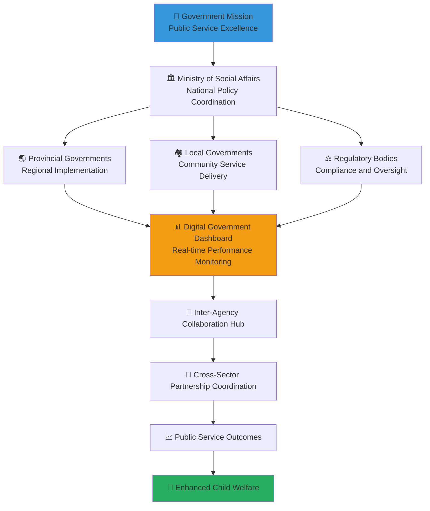

# Government Stakeholder Onboarding
## Comprehensive Guide for Public Sector Engagement in Child Welfare Excellence

> **Mission**: Enable government stakeholders to effectively leverage the MerajutASA platform for enhanced public service delivery, regulatory compliance, and child welfare policy implementation while fostering productive inter-agency collaboration and public-private partnerships.

---

## 🏛️ Government Onboarding Philosophy

### Public Service Excellence Through Digital Innovation
Government stakeholder onboarding focuses on public value creation and child welfare:

```yaml
Government Engagement Principles:
  Public Interest Priority: Every action serves the public interest and child welfare
  Digital Government Excellence: Leveraging technology for improved public services
  Transparency and Accountability: Open governance and public accountability
  Inter-Agency Collaboration: Breaking down silos for coordinated service delivery
  
Indonesian Government Values:
  Pancasila Integration: Aligning platform activities with national ideology
  Gotong Royong: Collaborative spirit in public service delivery
  Bhineka Tunggal Ika: Unity in diversity across all government levels
  Sustainable Development: Long-term thinking for child welfare improvements
```

### Government Sector Integration Model
Strategic framework for government participation in penta-helix collaboration:



---

## 📋 5-Day Government Onboarding Program

### Day 1: Government Context and Platform Foundation

#### Morning Session: Indonesian Government Child Welfare Landscape (4 hours)
```yaml
Session 1: Government Structure and Child Welfare Mandate (90 minutes)
  Content Overview:
    - Indonesian government structure from national to village level
    - Ministry of Social Affairs (Kemensos) role and responsibilities
    - Provincial and local government child welfare mandates
    - Legal framework: UU No. 35/2014 on Child Protection
    - Government social service delivery mechanisms
    
  Learning Objectives:
    - Understand government roles in child welfare system
    - Identify key government stakeholders and decision-makers
    - Map government resources and capabilities
    - Recognize legal and regulatory requirements
    
  Interactive Activities:
    - Government structure mapping exercise
    - Role and responsibility clarification
    - Legal framework analysis and discussion
    - Case study: Successful government child welfare initiatives

Session 2: Digital Government and Public Service Innovation (90 minutes)
  Content Overview:
    - Indonesia's Digital Government Strategy 2025
    - E-government best practices and success stories
    - Digital transformation in social services
    - Public-private partnership models in digital government
    - Citizen engagement through digital platforms
    
  Learning Objectives:
    - Understand digital government transformation principles
    - Identify opportunities for digital service improvement
    - Learn about successful digital government implementations
    - Develop digital collaboration skills
    
  Interactive Activities:
    - Digital government case study analysis
    - Platform demonstration and hands-on exploration
    - Discussion: Challenges and opportunities in digital transformation
    - Action planning for digital service integration
```

#### Afternoon Session: MerajutASA Platform for Government (4 hours)
```yaml
Session 3: Platform Overview and Government Benefits (90 minutes)
  Content Overview:
    - MerajutASA platform architecture and features
    - Government-specific portal: gov.merajutasa.id
    - Real-time compliance monitoring capabilities
    - Inter-agency collaboration tools and workflows
    - Data integration with government systems
    
  Learning Objectives:
    - Navigate government portal effectively
    - Understand government-specific platform features
    - Identify opportunities for process improvement
    - Plan for platform integration with existing systems
    
  Interactive Activities:
    - Guided platform tour and hands-on practice
    - Government dashboard exploration
    - Feature demonstration and Q&A
    - Integration planning workshop

Session 4: Data Governance and Regulatory Compliance (90 minutes)
  Content Overview:
    - Indonesian data protection regulations
    - GDPR compliance for international partnerships
    - Child data protection specific requirements
    - Audit trails and compliance reporting
    - Data sharing protocols between agencies
    
  Learning Objectives:
    - Understand data protection legal requirements
    - Implement secure data handling practices
    - Use compliance monitoring tools effectively
    - Plan for regulatory reporting and audit preparation
    
  Interactive Activities:
    - Compliance checklist creation
    - Data protection scenario analysis
    - Reporting dashboard hands-on practice
    - Audit preparation planning exercise
```

### Day 2: Inter-Agency Collaboration and Coordination

#### Morning Session: Government Coordination Mechanisms (4 hours)
```yaml
Session 5: Inter-Agency Collaboration Framework (90 minutes)
  Content Overview:
    - Horizontal coordination between ministries and agencies
    - Vertical coordination from national to local government
    - Information sharing protocols and agreements
    - Joint planning and resource coordination
    - Conflict resolution and consensus building
    
  Learning Objectives:
    - Master inter-agency collaboration techniques
    - Understand coordination protocols and procedures
    - Develop skills for managing inter-agency relationships
    - Plan coordinated responses to child welfare challenges
    
  Interactive Activities:
    - Inter-agency coordination simulation
    - Communication protocol development
    - Relationship mapping exercise
    - Coordination planning workshop

Session 6: Government Performance Monitoring and Evaluation (90 minutes)
  Content Overview:
    - Government performance indicator development
    - Real-time monitoring dashboard usage
    - Evidence-based policy development
    - Outcome measurement and impact assessment
    - Public reporting and transparency requirements
    
  Learning Objectives:
    - Develop and track government performance indicators
    - Use monitoring tools for continuous improvement
    - Create evidence-based policy recommendations
    - Prepare public reports and transparency documents
    
  Interactive Activities:
    - Performance indicator development exercise
    - Dashboard customization hands-on practice
    - Policy brief writing workshop
    - Public reporting template creation
```

#### Afternoon Session: Policy Development and Implementation (4 hours)
```yaml
Session 7: Evidence-Based Policy Development (90 minutes)
  Content Overview:
    - Policy development process and best practices
    - Research integration into policy formulation
    - Stakeholder consultation and engagement
    - Policy pilot testing and evaluation
    - Scaling successful policy interventions
    
  Learning Objectives:
    - Apply evidence-based policy development methods
    - Integrate research findings into policy design
    - Engage stakeholders effectively in policy development
    - Plan and implement policy pilots and evaluations
    
  Interactive Activities:
    - Policy development case study analysis
    - Stakeholder consultation planning exercise
    - Policy pilot design workshop
    - Evaluation framework development

Session 8: Regulatory Implementation and Enforcement (90 minutes)
  Content Overview:
    - Regulatory framework implementation strategies
    - Compliance monitoring and enforcement
    - Stakeholder communication and education
    - Regulatory impact assessment and improvement
    - Appeals and dispute resolution processes
    
  Learning Objectives:
    - Implement regulatory frameworks effectively
    - Monitor compliance and enforce regulations appropriately
    - Communicate regulatory requirements clearly
    - Continuously improve regulatory processes
    
  Interactive Activities:
    - Regulatory implementation planning
    - Compliance monitoring simulation
    - Communication strategy development
    - Process improvement workshop
```

### Day 3: Digital Government Tools and Systems

#### Morning Session: Government Technology Integration (4 hours)
```yaml
Session 9: Government System Integration (90 minutes)
  Content Overview:
    - API integration with existing government systems
    - Single sign-on (SSO) configuration for government users
    - Data exchange protocols and security
    - Workflow automation and process optimization
    - Legacy system integration strategies
    
  Learning Objectives:
    - Configure platform integration with government systems
    - Implement secure data exchange protocols
    - Optimize workflows for efficiency and effectiveness
    - Plan legacy system modernization and integration
    
  Interactive Activities:
    - System integration hands-on configuration
    - Data mapping and exchange protocol setup
    - Workflow optimization exercise
    - Integration roadmap development

Session 10: Security and Compliance Implementation (90 minutes)
  Content Overview:
    - Government cybersecurity requirements and standards
    - Multi-factor authentication and access control
    - Data encryption and secure communication
    - Incident response and security monitoring
    - Compliance audit and reporting procedures
    
  Learning Objectives:
    - Implement government-grade security measures
    - Configure appropriate access controls and permissions
    - Monitor security and respond to incidents effectively
    - Maintain compliance with security standards
    
  Interactive Activities:
    - Security configuration hands-on practice
    - Access control setup and testing
    - Incident response simulation
    - Compliance checklist completion
```

#### Afternoon Session: Public Service Delivery Enhancement (4 hours)
```yaml
Session 11: Citizen Engagement and Service Delivery (90 minutes)
  Content Overview:
    - Digital service design and citizen experience
    - Multi-channel service delivery coordination
    - Citizen feedback collection and integration
    - Service quality measurement and improvement
    - Accessibility and inclusive service design
    
  Learning Objectives:
    - Design citizen-centered digital services
    - Coordinate multi-channel service delivery effectively
    - Collect and integrate citizen feedback for improvement
    - Measure and continuously improve service quality
    
  Interactive Activities:
    - Service design workshop
    - Citizen journey mapping exercise
    - Feedback system configuration
    - Service improvement planning

Session 12: Performance Management and Reporting (90 minutes)
  Content Overview:
    - Government performance dashboard configuration
    - Key performance indicator (KPI) development and tracking
    - Automated reporting and alert systems
    - Public transparency and open data initiatives
    - Performance improvement action planning
    
  Learning Objectives:
    - Configure performance monitoring dashboards
    - Develop meaningful KPIs for government operations
    - Implement automated reporting and alert systems
    - Plan public transparency and accountability measures
    
  Interactive Activities:
    - Dashboard configuration hands-on practice
    - KPI development workshop
    - Automated reporting setup
    - Transparency planning exercise
```

### Day 4: Cross-Sector Partnership Development

#### Morning Session: Public-Private Partnership Excellence (4 hours)
```yaml
Session 13: PPP Development and Management (90 minutes)
  Content Overview:
    - Public-private partnership models and best practices
    - Partnership agreement development and negotiation
    - Risk sharing and value creation frameworks
    - Performance monitoring and contract management
    - Partnership sustainability and renewal strategies
    
  Learning Objectives:
    - Develop effective public-private partnerships
    - Negotiate partnership agreements that create mutual value
    - Manage partnership performance and relationships
    - Plan for long-term partnership sustainability
    
  Interactive Activities:
    - PPP model analysis and selection exercise
    - Partnership agreement drafting workshop
    - Performance monitoring framework development
    - Sustainability planning session

Session 14: Cross-Sector Collaboration Facilitation (90 minutes)
  Content Overview:
    - Multi-stakeholder engagement strategies
    - Facilitation skills for cross-sector meetings
    - Conflict resolution and consensus building
    - Innovation and co-creation processes
    - Network building and relationship management
    
  Learning Objectives:
    - Facilitate effective multi-stakeholder collaboration
    - Resolve conflicts and build consensus across sectors
    - Lead innovation and co-creation initiatives
    - Build and maintain productive cross-sector relationships
    
  Interactive Activities:
    - Multi-stakeholder meeting facilitation practice
    - Conflict resolution simulation
    - Innovation workshop facilitation
    - Relationship mapping and planning exercise
```

#### Afternoon Session: Innovation and Policy Leadership (4 hours)
```yaml
Session 15: Government Innovation Leadership (90 minutes)
  Content Overview:
    - Innovation culture development in government
    - Digital transformation leadership
    - Change management in public sector organizations
    - Innovation pilot design and implementation
    - Scaling innovation across government levels
    
  Learning Objectives:
    - Lead innovation initiatives in government context
    - Manage digital transformation effectively
    - Implement change management strategies
    - Design and execute innovation pilots
    
  Interactive Activities:
    - Innovation strategy development workshop
    - Change management planning exercise
    - Pilot design and implementation simulation
    - Scaling strategy development

Session 16: Policy Influence and Advocacy (90 minutes)
  Content Overview:
    - Policy advocacy strategies and techniques
    - Stakeholder coalition building
    - Evidence presentation and policy briefing
    - Media engagement and public communication
    - International policy learning and adaptation
    
  Learning Objectives:
    - Develop effective policy advocacy strategies
    - Build coalitions for policy change
    - Present evidence effectively to decision-makers
    - Engage with media and public on policy issues
    
  Interactive Activities:
    - Policy advocacy strategy development
    - Coalition building simulation
    - Policy briefing presentation practice
    - Media engagement planning workshop
```

### Day 5: Implementation Planning and Network Integration

#### Morning Session: Implementation Roadmap Development (4 hours)
```yaml
Session 17: Government Implementation Planning (90 minutes)
  Content Overview:
    - Implementation roadmap development
    - Resource allocation and budget planning
    - Timeline development and milestone setting
    - Risk assessment and mitigation planning
    - Success metrics and evaluation framework
    
  Learning Objectives:
    - Develop comprehensive implementation roadmaps
    - Plan resource allocation and budget requirements
    - Set realistic timelines and achievable milestones
    - Assess risks and develop mitigation strategies
    
  Interactive Activities:
    - Implementation roadmap creation workshop
    - Resource planning and budget development
    - Risk assessment and mitigation planning
    - Success metrics definition exercise

Session 18: Organizational Change Management (90 minutes)
  Content Overview:
    - Change management strategies for government organizations
    - Staff training and capacity building planning
    - Communication and engagement strategies
    - Resistance management and buy-in building
    - Culture change and continuous improvement
    
  Learning Objectives:
    - Plan and implement organizational change effectively
    - Develop staff capacity for new ways of working
    - Communicate change effectively throughout organization
    - Build support and manage resistance to change
    
  Interactive Activities:
    - Change management plan development
    - Training program design workshop
    - Communication strategy planning
    - Resistance management simulation
```

#### Afternoon Session: Network Integration and Ongoing Support (4 hours)
```yaml
Session 19: Government Network Integration (90 minutes)
  Content Overview:
    - Government stakeholder network mapping
    - Professional association and community engagement
    - Peer learning and knowledge sharing
    - Mentorship and ongoing support systems
    - Government sector leadership development
    
  Learning Objectives:
    - Integrate effectively into government stakeholder network
    - Engage with professional associations and communities
    - Participate in peer learning and knowledge sharing
    - Access mentorship and ongoing support resources
    
  Interactive Activities:
    - Network mapping and relationship planning
    - Professional development planning workshop
    - Peer learning group formation
    - Mentorship planning and setup

Session 20: Graduation and Continuing Journey (90 minutes)
  Content Overview:
    - Onboarding completion and certification
    - Ongoing learning and development opportunities
    - Government sector contribution planning
    - Platform feedback and improvement suggestions
    - Celebration and recognition ceremony
    
  Learning Objectives:
    - Complete onboarding certification requirements
    - Plan ongoing professional development journey
    - Commit to government sector contributions
    - Provide feedback for continuous improvement
    
  Interactive Activities:
    - Onboarding assessment and certification
    - Professional development goal setting
    - Contribution commitment ceremony
    - Feedback collection and future planning
```

---

## 🎯 Government-Specific Platform Features

### Government Portal: gov.merajutasa.id

#### Real-Time Compliance Monitoring Dashboard
```yaml
Compliance Features:
  Regulatory Compliance Tracking:
    - Real-time monitoring of orphanage compliance with regulations
    - Automated alerts for compliance violations or concerns
    - Compliance trend analysis and reporting
    - Predictive analytics for compliance risk assessment
    
  Legal Framework Integration:
    - Integration with Indonesian child protection laws
    - Automated compliance checking against legal requirements
    - Legal update notifications and impact assessment
    - Documentation and audit trail for legal compliance
    
  Multi-Level Government Coordination:
    - National, provincial, and local government dashboard views
    - Inter-agency collaboration tools and workflows
    - Shared case management across government levels
    - Resource coordination and allocation tracking
```

#### Policy Development and Implementation Tools
```yaml
Evidence-Based Policy Features:
  Research Integration:
    - Access to anonymized research data and findings
    - Evidence summary reports for policy development
    - Research collaboration tools with academic partners
    - Policy impact prediction and modeling
    
  Stakeholder Consultation:
    - Multi-stakeholder consultation facilitation tools
    - Public comment collection and analysis
    - Stakeholder feedback integration and reporting
    - Consensus building and decision support tools
    
  Policy Pilot Management:
    - Pilot program design and implementation tools
    - Real-time pilot monitoring and evaluation
    - Pilot scaling decision support
    - Policy effectiveness measurement and reporting
```

#### Public Service Delivery Enhancement
```yaml
Service Delivery Features:
  Citizen Engagement:
    - Public portal for citizen access to child welfare services
    - Multi-channel service delivery coordination
    - Citizen feedback collection and response management
    - Service quality monitoring and improvement tools
    
  Performance Management:
    - Government performance dashboard and KPI tracking
    - Automated reporting and transparency tools
    - Public accountability and open data features
    - Service delivery analytics and optimization
    
  Emergency Response:
    - Crisis response coordination and communication tools
    - Emergency resource allocation and management
    - Multi-agency crisis response workflows
    - Public communication and media coordination
```

---

## 📊 Government Success Metrics and Outcomes

### Individual Government Stakeholder Success
```yaml
Knowledge and Competency:
  Platform Proficiency: >95% completion of government-specific platform training
  Policy Development Skills: >90% competency in evidence-based policy development
  Collaboration Skills: >85% effectiveness rating in cross-sector collaboration
  Digital Government Knowledge: >90% proficiency in digital government best practices
  
Performance and Contribution:
  Implementation Success: Successful implementation of at least one platform feature
  Policy Contribution: Contribution to at least one policy development initiative
  Network Integration: Active participation in government stakeholder network
  Innovation Leadership: Leadership or participation in at least one innovation project
```

### Government Sector Collective Impact
```yaml
Public Service Improvement:
  Service Delivery Enhancement: 30% improvement in child welfare service delivery speed
  Citizen Satisfaction: >4.5/5.0 citizen satisfaction with government child welfare services
  Inter-Agency Coordination: 50% improvement in cross-agency collaboration effectiveness
  Regulatory Compliance: >95% orphanage compliance with government regulations
  
Policy and System Innovation:
  Evidence-Based Policy: 100% of new child welfare policies based on platform evidence
  Digital Government Progress: 40% increase in digital government service adoption
  Cost Efficiency: 25% reduction in administrative costs through platform efficiency
  International Recognition: Recognition as model for digital government innovation
```

### National Child Welfare System Impact
```yaml
System Transformation:
  Coverage and Access: 60% increase in child welfare service coverage across Indonesia
  Quality and Standards: 40% improvement in child welfare service quality metrics
  Coordination and Efficiency: 50% improvement in government coordination effectiveness
  Innovation and Adaptation: Government system recognized for innovation and best practices
  
Long-Term Outcomes:
  Child Welfare Improvement: Measurable improvement in child welfare outcomes
  Government Effectiveness: Enhanced government effectiveness in child protection
  Public Trust: Increased public trust in government child welfare services
  International Leadership: Indonesian government recognized as regional leader
```

---

## 🛠️ Government-Specific Support Resources

### Technical Support and Integration
```yaml
Government IT Support:
  System Integration: Dedicated support for government system integration
  Security Configuration: Expert assistance with government security requirements
  Data Migration: Support for migrating existing government data to platform
  Training Resources: Government-specific technical training and documentation
  
Ongoing Technical Support:
  Help Desk: Priority support for government stakeholders
  System Maintenance: Regular maintenance and updates for government features
  Security Monitoring: Continuous security monitoring and threat protection
  Performance Optimization: Regular performance monitoring and optimization
```

### Policy and Legal Support
```yaml
Legal and Compliance Support:
  Legal Advisory: Access to legal experts for compliance and regulatory questions
  Policy Development: Support for evidence-based policy development initiatives
  Regulatory Analysis: Assistance with regulatory impact assessment and compliance
  Best Practices: Access to international best practices and benchmarking
  
Professional Development:
  Government Training: Ongoing training programs for government professionals
  Leadership Development: Leadership development programs for government leaders
  Innovation Support: Support for government innovation initiatives
  Network Building: Facilitation of government professional networks
```

### Partnership and Collaboration Support
```yaml
Partnership Development:
  PPP Support: Expert assistance with public-private partnership development
  Cross-Sector Facilitation: Support for cross-sector collaboration initiatives
  International Partnerships: Facilitation of international government partnerships
  Knowledge Exchange: Support for government knowledge sharing and learning
  
Strategic Planning:
  Implementation Support: Ongoing support for government implementation initiatives
  Performance Monitoring: Support for government performance monitoring and evaluation
  Strategic Planning: Assistance with strategic planning and goal setting
  Continuous Improvement: Support for continuous improvement and innovation
```

---

## 📞 Government Stakeholder Support and Contact

### Government Coordination Team
```yaml
Government Relations Manager:
  Email: government@merajutasa.id
  Phone: +62-21-XXXX-XXXX
  WhatsApp: +62-8XX-XXXX-XXXX
  Office Hours: Monday-Friday, 8 AM - 6 PM WIB
  
Government Technical Support:
  Email: gov-tech@merajutasa.id
  Phone: +62-21-XXXX-XXXX (Technical hotline)
  Response Time: 4 hours for technical issues, 24 hours for general inquiries
  Emergency Support: 24/7 support for critical government systems
  
Government Policy and Legal Support:
  Email: gov-policy@merajutasa.id
  Phone: +62-21-XXXX-XXXX
  Response Time: 48 hours for policy questions, 4 hours for urgent legal matters
  Expert Consultation: Weekly expert consultation sessions available
```

### Government Community and Resources
```yaml
Government Stakeholder Community:
  Government Portal: gov.merajutasa.id
  Discussion Forums: Active government stakeholder discussion and support
  Resource Library: Government-specific resources, templates, and best practices
  Peer Learning: Regular government stakeholder learning and networking events
  
Professional Development:
  Government Training Calendar: Regular training and development opportunities
  Best Practice Sharing: Government success story sharing and learning
  Innovation Showcase: Government innovation recognition and celebration
  International Exchange: Government international learning and partnership opportunities
```

---

**Platform**: MerajutASA - Indonesian Child Welfare Platform  
**Government Portal**: gov.merajutasa.id  
**Mission**: Public service excellence through digital innovation for child welfare  
**Support**: Comprehensive government stakeholder success and impact
