# Media Stakeholder Onboarding
## Strategic Communication and Ethical Journalism for Child Welfare Advocacy

> **Mission**: Enable media stakeholders to create compelling, ethical, and impactful communication that raises awareness about child welfare issues, amplifies positive solutions, and drives sustainable social change through responsible journalism and strategic content creation.

---

## 📺 Media Onboarding Philosophy

### Ethical Journalism for Social Impact
Media stakeholder engagement focuses on responsible reporting and solution-oriented journalism:

```yaml
Media Engagement Principles:
  Child Protection First: Always prioritize child safety and privacy in reporting
  Solution-Oriented Journalism: Focus on solutions and positive change possibilities
  Ethical Reporting: Adhere to highest standards of journalistic ethics and integrity
  Impact Amplification: Use media power to amplify positive social impact
  
Indonesian Media Values:
  Pancasila Journalism: Journalism aligned with Indonesian national principles
  Community Service: Media as service to community and national development
  Cultural Sensitivity: Respectful reporting on diverse Indonesian communities
  Social Responsibility: Media responsibility for social progress and child welfare
```

### Media Sector Integration Model
Strategic framework for media participation in penta-helix collaboration:

```mermaid
graph TD
    A[🎯 Media Mission<br/>Ethical Communication for Child Welfare] --> B[📰 Traditional Media<br/>Newspapers, TV, Radio]
    
    B --> C[💻 Digital Media<br/>Online News and Platforms]
    B --> D[📱 Social Media<br/>Influencers and Content Creators]
    B --> E[🎥 Independent Journalists<br/>Freelance and Documentary]
    B --> F[📢 Communication Professionals<br/>PR and Marketing Specialists]
    
    C --> G[📊 Media Impact Hub<br/>Story Analytics and Reach Measurement]
    D --> G
    E --> G
    F --> G
    
    G --> H[🌟 Content Amplification Network]
    H --> I[🔄 Cross-Platform Story Distribution]
    
    I --> J[📈 Public Awareness and Engagement]
    J --> K[👶 Enhanced Child Welfare Through Communication]
    
    style A fill:#8E44AD
    style G fill:#F39C12
    style K fill:#27AE60
```



---

## 📋 5-Day Media Onboarding Program

### Day 1: Ethical Journalism and Child Welfare Reporting

#### Morning Session: Journalistic Ethics and Child Protection (4 hours)
```yaml
Session 1: Ethical Journalism Standards and Child Protection (90 minutes)
  Content Overview:
    - International journalistic ethics standards and guidelines
    - UNICEF guidelines for reporting on children and child rights
    - Indonesian Press Council ethics code and child protection provisions
    - Privacy protection and consent procedures for child-related stories
    - Trauma-informed journalism and sensitive reporting practices
    
  Learning Objectives:
    - Apply ethical journalism standards to child welfare reporting
    - Understand legal and ethical requirements for reporting on children
    - Implement privacy protection and consent procedures
    - Practice trauma-informed and sensitive reporting approaches
    
  Interactive Activities:
    - Ethics case study analysis and discussion
    - Privacy protection protocol development
    - Consent procedure practice and role-playing
    - Sensitive reporting simulation and feedback

Session 2: Solution-Oriented Journalism and Constructive Reporting (90 minutes)
  Content Overview:
    - Solution-oriented journalism principles and methodologies
    - Constructive journalism and positive impact reporting
    - Investigative journalism for social change and accountability
    - Data journalism and evidence-based reporting
    - Collaborative journalism and cross-newsroom cooperation
    
  Learning Objectives:
    - Apply solution-oriented journalism to child welfare stories
    - Create constructive narratives that inspire action
    - Use investigative techniques for accountability journalism
    - Integrate data and evidence into compelling narratives
    
  Interactive Activities:
    - Solution-oriented story development workshop
    - Constructive narrative creation exercise
    - Investigative journalism planning session
    - Data journalism and visualization practice
```

#### Afternoon Session: MerajutASA Media Platform Introduction (4 hours)
```yaml
Session 3: Media Portal and Content Creation Tools (90 minutes)
  Content Overview:
    - MerajutASA media portal: media.merajutasa.id
    - Press kit access and media resource library
    - Content creation and collaboration tools
    - Interview coordination and source access
    - Media asset management and licensing
    
  Learning Objectives:
    - Navigate media portal effectively
    - Access press kits and media resources efficiently
    - Use content creation and collaboration tools
    - Coordinate interviews and access appropriate sources
    
  Interactive Activities:
    - Media portal guided tour and hands-on practice
    - Press kit exploration and utilization exercise
    - Content creation tool training
    - Interview coordination simulation

Session 4: Content Strategy and Editorial Planning (90 minutes)
  Content Overview:
    - Content strategy development for social impact
    - Editorial calendar planning and content scheduling
    - Multi-platform content adaptation and distribution
    - Audience engagement and community building
    - Content performance measurement and optimization
    
  Learning Objectives:
    - Develop strategic approach to content creation
    - Plan editorial calendars for maximum impact
    - Adapt content for different platforms and audiences
    - Build engaged audiences around social impact content
    
  Interactive Activities:
    - Content strategy development workshop
    - Editorial calendar creation exercise
    - Multi-platform adaptation planning
    - Audience engagement strategy development
```

### Day 2: Storytelling and Content Creation Excellence

#### Morning Session: Compelling Storytelling for Social Impact (4 hours)
```yaml
Session 5: Narrative Storytelling and Human Interest (90 minutes)
  Content Overview:
    - Narrative storytelling techniques for social impact
    - Human interest story development and character building
    - Emotional engagement and empathy building in storytelling
    - Visual storytelling and multimedia narrative creation
    - Cultural storytelling and Indonesian narrative traditions
    
  Learning Objectives:
    - Create compelling narratives that drive social change
    - Develop human interest stories that inspire action
    - Use emotional engagement appropriately and ethically
    - Integrate visual and multimedia elements effectively
    
  Interactive Activities:
    - Narrative development workshop with real case studies
    - Character development and story arc creation
    - Emotional engagement practice and feedback
    - Visual storytelling and multimedia creation exercise

Session 6: Data Journalism and Evidence-Based Reporting (90 minutes)
  Content Overview:
    - Data journalism techniques and best practices
    - Data visualization and infographic creation
    - Statistical analysis and interpretation for journalists
    - Fact-checking and verification methodologies
    - Evidence-based reporting and source validation
    
  Learning Objectives:
    - Use data journalism techniques effectively
    - Create compelling data visualizations and infographics
    - Interpret statistics and research findings accurately
    - Implement rigorous fact-checking and verification
    
  Interactive Activities:
    - Data analysis and interpretation exercise
    - Data visualization creation workshop
    - Fact-checking methodology practice
    - Evidence verification simulation
```

#### Afternoon Session: Digital Content Creation and Distribution (4 hours)
```yaml
Session 7: Digital Content Creation and Optimization (90 minutes)
  Content Overview:
    - Digital content creation best practices
    - SEO optimization and content discoverability
    - Social media content adaptation and scheduling
    - Video and podcast content creation and editing
    - Interactive content and audience engagement features
    
  Learning Objectives:
    - Create optimized digital content for maximum reach
    - Use SEO techniques for content discoverability
    - Adapt content for social media platforms effectively
    - Produce high-quality video and audio content
    
  Interactive Activities:
    - Digital content creation workshop
    - SEO optimization practice
    - Social media content adaptation exercise
    - Video and podcast production training

Session 8: Multi-Platform Distribution and Amplification (90 minutes)
  Content Overview:
    - Multi-platform content distribution strategies
    - Platform-specific content optimization and adaptation
    - Influencer collaboration and partnership development
    - Content syndication and republication strategies
    - Cross-platform audience building and engagement
    
  Learning Objectives:
    - Develop comprehensive distribution strategies
    - Optimize content for specific platforms and audiences
    - Build partnerships with influencers and other content creators
    - Maximize content reach through strategic syndication
    
  Interactive Activities:
    - Distribution strategy development workshop
    - Platform optimization exercise
    - Influencer partnership planning
    - Syndication strategy creation
```

### Day 3: Interview Skills and Source Development

#### Morning Session: Interview Excellence and Source Relations (4 hours)
```yaml
Session 9: Professional Interview Techniques (90 minutes)
  Content Overview:
    - Interview preparation and research strategies
    - Interview techniques for different types of sources
    - Sensitive interview approaches for vulnerable populations
    - Remote interview best practices and technology usage
    - Interview ethics and consent procedures
    
  Learning Objectives:
    - Prepare thoroughly for professional interviews
    - Adapt interview techniques for different source types
    - Conduct sensitive interviews with vulnerable populations
    - Use technology effectively for remote interviews
    
  Interactive Activities:
    - Interview preparation workshop with case studies
    - Interview technique practice with feedback
    - Sensitive interview simulation
    - Remote interview technology training

Session 10: Source Development and Relationship Building (90 minutes)
  Content Overview:
    - Source identification and development strategies
    - Relationship building with key stakeholders
    - Expert source cultivation and maintenance
    - Whistleblower protection and confidential source management
    - Cross-sector source network development
    
  Learning Objectives:
    - Identify and develop reliable sources
    - Build long-term relationships with key stakeholders
    - Cultivate expert sources for specialized knowledge
    - Protect confidential sources and whistleblowers
    
  Interactive Activities:
    - Source mapping and development exercise
    - Relationship building strategy workshop
    - Expert source cultivation planning
    - Confidential source protection simulation
```

#### Afternoon Session: Specialized Child Welfare Reporting (4 hours)
```yaml
Session 11: Child Welfare Beat Reporting (90 minutes)
  Content Overview:
    - Child welfare beat development and coverage strategies
    - Government social services reporting and accountability
    - NGO and nonprofit sector coverage and evaluation
    - Policy reporting and legislative coverage
    - International child welfare story development
    
  Learning Objectives:
    - Develop specialized expertise in child welfare reporting
    - Cover government social services effectively and fairly
    - Report on nonprofit sector with depth and nuance
    - Analyze and report on policy developments
    
  Interactive Activities:
    - Beat development and coverage planning workshop
    - Government accountability reporting exercise
    - Nonprofit sector analysis and evaluation
    - Policy analysis and reporting practice

Session 12: Crisis Communication and Emergency Reporting (90 minutes)
  Content Overview:
    - Crisis communication principles and protocols
    - Emergency reporting procedures and safety considerations
    - Trauma-informed crisis reporting and victim protection
    - Rumor control and misinformation prevention
    - Coordination with emergency responders and authorities
    
  Learning Objectives:
    - Report on crises and emergencies responsibly
    - Protect victims and vulnerable populations during crisis reporting
    - Prevent spread of misinformation and rumors
    - Coordinate effectively with emergency responders
    
  Interactive Activities:
    - Crisis reporting simulation and practice
    - Trauma-informed reporting exercise
    - Misinformation prevention workshop
    - Emergency coordination protocol development
```

### Day 4: Brand Collaboration and Marketing Integration

#### Morning Session: Authentic Brand Partnership (4 hours)
```yaml
Session 13: Ethical Brand Collaboration and Sponsorship (90 minutes)
  Content Overview:
    - Ethical guidelines for brand collaboration and sponsorship
    - Editorial independence and advertiser relationship management
    - Transparent disclosure and audience trust maintenance
    - Brand alignment with social impact and journalistic values
    - Long-term partnership development and sustainability
    
  Learning Objectives:
    - Maintain editorial independence while developing brand partnerships
    - Disclose brand relationships transparently and appropriately
    - Align brand partnerships with journalistic and social impact values
    - Develop sustainable long-term brand partnerships
    
  Interactive Activities:
    - Brand partnership ethics workshop
    - Editorial independence assessment and planning
    - Disclosure strategy development
    - Brand alignment evaluation exercise

Session 14: Content Marketing and Thought Leadership (90 minutes)
  Content Overview:
    - Content marketing strategies for social impact
    - Thought leadership development and positioning
    - Expert commentary and opinion writing
    - Conference speaking and presentation skills
    - Industry influence and professional reputation building
    
  Learning Objectives:
    - Develop content marketing strategies aligned with social impact
    - Position yourself as thought leader in child welfare and social impact
    - Write compelling expert commentary and opinion pieces
    - Speak effectively at conferences and professional events
    
  Interactive Activities:
    - Content marketing strategy development
    - Thought leadership positioning workshop
    - Opinion piece writing exercise
    - Conference presentation preparation and practice
```

#### Afternoon Session: Audience Development and Engagement (4 hours)
```yaml
Session 15: Audience Building and Community Management (90 minutes)
  Content Overview:
    - Audience development strategies for social impact content
    - Community building and engagement techniques
    - Social media audience growth and retention
    - Email marketing and newsletter development
    - Audience analytics and engagement measurement
    
  Learning Objectives:
    - Build engaged audiences for social impact content
    - Create and manage online communities effectively
    - Grow social media audiences authentically
    - Develop effective email marketing and newsletters
    
  Interactive Activities:
    - Audience development strategy workshop
    - Community building planning exercise
    - Social media growth strategy development
    - Email marketing campaign creation

Session 16: Engagement Optimization and Conversion (90 minutes)
  Content Overview:
    - Content engagement optimization techniques
    - Call-to-action development and conversion optimization
    - Audience feedback collection and integration
    - Community moderation and conflict resolution
    - Engagement measurement and performance optimization
    
  Learning Objectives:
    - Optimize content for maximum audience engagement
    - Create effective calls-to-action that drive social impact
    - Collect and integrate audience feedback effectively
    - Moderate communities and resolve conflicts professionally
    
  Interactive Activities:
    - Engagement optimization workshop
    - Call-to-action development exercise
    - Feedback collection system design
    - Community moderation simulation
```

### Day 5: Impact Measurement and Professional Development

#### Morning Session: Media Impact Measurement and Analytics (4 hours)
```yaml
Session 17: Content Performance Analytics and Measurement (90 minutes)
  Content Overview:
    - Media analytics and performance measurement tools
    - Reach, engagement, and conversion tracking
    - Social impact measurement for media content
    - Attribution analysis and impact assessment
    - Performance optimization based on data insights
    
  Learning Objectives:
    - Use analytics tools to measure content performance
    - Track reach, engagement, and conversion metrics effectively
    - Measure social impact of media content
    - Optimize content performance based on data insights
    
  Interactive Activities:
    - Analytics tool training and hands-on practice
    - Performance measurement framework development
    - Impact assessment methodology workshop
    - Data-driven optimization exercise

Session 18: Professional Development and Career Advancement (90 minutes)
  Content Overview:
    - Media career development and advancement strategies
    - Portfolio development and professional branding
    - Professional networking and relationship building
    - Continuing education and skill development
    - Media entrepreneurship and independent career paths
    
  Learning Objectives:
    - Plan professional development and career advancement
    - Build strong professional portfolio and brand
    - Develop professional networks and relationships
    - Pursue continuing education and skill development
    
  Interactive Activities:
    - Career development planning workshop
    - Portfolio development and review exercise
    - Professional networking strategy development
    - Skill development and education planning
```

#### Afternoon Session: Industry Leadership and Innovation (4 hours)
```yaml
Session 19: Media Innovation and Industry Leadership (90 minutes)
  Content Overview:
    - Media innovation and technology adoption
    - Industry leadership and professional contribution
    - Media ethics and standards development
    - Professional association participation and leadership
    - Media education and mentorship
    
  Learning Objectives:
    - Lead media innovation and technology adoption
    - Contribute to industry leadership and professional development
    - Develop and promote media ethics and standards
    - Participate in and lead professional associations
    
  Interactive Activities:
    - Innovation strategy development workshop
    - Industry leadership planning exercise
    - Ethics and standards development simulation
    - Professional association engagement planning

Session 20: Graduation and Media Network Integration (90 minutes)
  Content Overview:
    - Onboarding completion and certification
    - Media stakeholder network integration
    - Ongoing learning and professional development
    - Media sector contribution and leadership planning
    - Professional celebration and recognition ceremony
    
  Learning Objectives:
    - Complete onboarding certification requirements
    - Integrate effectively into media stakeholder network
    - Plan ongoing professional development and learning
    - Commit to media sector leadership and contribution
    
  Interactive Activities:
    - Onboarding assessment and certification
    - Network integration planning and introductions
    - Professional development goal setting
    - Leadership commitment ceremony and celebration
```

---

## 🎯 Media-Specific Platform Features

### Media Portal: media.merajutasa.id

#### Content Creation and Asset Management
```yaml
Media Resource Features:
  Press Kit and Media Assets:
    - Comprehensive press kit with facts, figures, and background information
    - High-resolution photos, videos, and graphics for editorial use
    - Interview availability and source contact information
    - Brand guidelines and logo usage permissions
    
  Content Creation Tools:
    - Story idea generator and editorial calendar integration
    - Research database access and fact-checking resources
    - Quote and interview management system
    - Collaborative content creation and editing tools
    
  Asset Licensing and Usage:
    - Clear licensing terms for media asset usage
    - Attribution requirements and usage guidelines
    - Download tracking and usage analytics
    - Copyright protection and fair use guidelines
```

#### Story Development and Source Access
```yaml
Editorial Support Features:
  Source Access and Coordination:
    - Verified expert source directory with contact information
    - Interview scheduling and coordination system
    - Background briefing and context provision
    - Source protection and confidentiality management
    
  Story Development Support:
    - Story pitch submission and feedback system
    - Editorial guidance and expert consultation
    - Fact-checking support and verification assistance
    - Legal review and compliance support
    
  Research and Data Access:
    - Access to platform research and impact data
    - Anonymized case studies and success stories
    - Statistical analysis and trend identification
    - Comparative analysis and benchmarking data
```

#### Distribution and Amplification
```yaml
Content Distribution Features:
  Multi-Platform Publishing:
    - Content syndication and republication coordination
    - Social media scheduling and cross-platform distribution
    - Email newsletter integration and distribution
    - Podcast and video distribution support
    
  Audience Development:
    - Audience analytics and engagement measurement
    - Content performance tracking and optimization
    - Audience segmentation and targeted distribution
    - Community building and engagement tools
    
  Impact Measurement:
    - Content reach and engagement analytics
    - Social impact measurement and attribution
    - Audience behavior and conversion tracking
    - Performance optimization recommendations
```

---

## 📊 Media Success Metrics and Outcomes

### Individual Media Stakeholder Success
```yaml
Professional Excellence:
  Content Quality: >95% content meets professional journalism standards
  Ethical Compliance: 100% compliance with journalistic ethics and child protection guidelines
  Audience Engagement: >4.5/5.0 average audience engagement and satisfaction rating
  Professional Recognition: Recognition by peers and industry organizations
  
Content Impact:
  Reach and Engagement: Measurable growth in audience reach and engagement
  Social Impact: Documented social impact from content creation and distribution
  Policy Influence: Content contributing to policy discussions and changes
  Community Engagement: Active community building and audience development
```

### Media Sector Collective Impact
```yaml
Content Creation and Distribution:
  Content Volume: XXX high-quality articles, videos, and multimedia content produced annually
  Audience Reach: XX million people reached through media coverage and content
  Platform Coverage: XXX media outlets covering MerajutASA and child welfare issues
  Content Syndication: XXX content pieces syndicated across multiple platforms
  
Public Awareness and Engagement:
  Awareness Increase: XX% increase in public awareness of child welfare issues
  Engagement Growth: XXX% growth in social media engagement on child welfare content
  Public Discourse: Measurable improvement in quality of public discourse on child welfare
  Policy Discussion: Media coverage contributing to XX policy discussions and changes
```

### Child Welfare Media Impact
```yaml
Direct Child Welfare Advocacy:
  Advocacy Coverage: XXX advocacy pieces raising awareness for child welfare issues
  Solution Amplification: XXX solution-oriented stories highlighting positive interventions
  Policy Advocacy: Media advocacy contributing to XX policy improvements for children
  Resource Mobilization: Media coverage contributing to $X in additional resource mobilization
  
Long-Term Social Change:
  Attitude Change: Measurable positive change in public attitudes toward child welfare
  Behavior Change: Documentation of behavior change inspired by media coverage
  System Improvement: Media accountability coverage contributing to system improvements
  Cultural Shift: Contribution to cultural shift toward greater child protection awareness
```

---

## 🛠️ Media-Specific Support Resources

### Content Creation and Editorial Support
```yaml
Editorial and Creative Support:
  Editorial Guidance: Professional editorial guidance and content development support
  Fact-Checking: Professional fact-checking and verification assistance
  Legal Review: Legal review for sensitive content and investigative pieces
  Creative Development: Creative guidance for multimedia content development
  
Research and Data Support:
  Research Access: Access to comprehensive research and data resources
  Expert Consultation: Consultation with subject matter experts and specialists
  Background Briefings: Regular background briefings on child welfare issues and developments
  Data Analysis: Professional data analysis and interpretation support
```

### Professional Development and Training
```yaml
Skills Development:
  Journalism Training: Advanced journalism skills training and development
  Technology Training: Training on new media technologies and tools
  Ethics Training: Ongoing training on journalism ethics and best practices
  Specialized Training: Training on child welfare beat reporting and social impact journalism
  
Career Development:
  Mentorship: Professional mentorship and career guidance
  Portfolio Development: Assistance with portfolio development and professional branding
  Networking: Professional networking and relationship building opportunities
  Career Advancement: Support for career advancement and professional recognition
```

### Technology and Platform Support
```yaml
Technical Support:
  Platform Training: Comprehensive training on media portal features and tools
  Content Management: Training on content management and distribution systems
  Analytics Training: Training on content analytics and performance measurement
  Technology Support: Technical support for content creation and distribution tools
  
Innovation and Development:
  Innovation Labs: Access to media innovation labs and technology development
  Beta Testing: Opportunity to beta test new media tools and platforms
  Feedback Integration: Regular feedback integration for platform improvement
  Custom Development: Custom tool development for specialized media needs
```

---

## 📞 Media Stakeholder Support and Contact

### Media Relations Team
```yaml
Media Relations Manager:
  Email: media@merajutasa.id
  Phone: +62-21-XXXX-XXXX
  WhatsApp: +62-8XX-XXXX-XXXX
  Office Hours: Monday-Friday, 8 AM - 6 PM WIB
  
Press and Communications Specialist:
  Email: press@merajutasa.id
  Phone: +62-21-XXXX-XXXX (Press hotline)
  Response Time: 2 hours for media inquiries, 30 minutes for breaking news
  Emergency Media Line: 24/7 emergency media contact for urgent situations
  
Content Development Manager:
  Email: content@merajutasa.id
  Phone: +62-21-XXXX-XXXX
  Response Time: 24 hours for content collaboration inquiries
  Creative Support: Weekly creative development and content strategy sessions
```

### Media Community and Resources
```yaml
Media Stakeholder Network:
  Media Portal: media.merajutasa.id
  Press Room: Comprehensive press room with all media resources and materials
  Media Forums: Active media professional discussion and collaboration forums
  Media Events: Regular media networking and professional development events
  
Professional Development:
  Media Training Calendar: Regular training and development opportunities for media professionals
  Industry Conferences: Media industry conference participation and speaking opportunities
  Awards and Recognition: Media excellence awards and professional recognition programs
  International Exchange: International media exchange and collaboration opportunities
```

### Content Collaboration and Support
```yaml
Editorial Collaboration:
  Story Development: Collaborative story development and editorial planning
  Source Coordination: Expert source coordination and interview facilitation
  Research Support: Research and data access for investigative and feature reporting
  Fact-Checking: Professional fact-checking and verification services
  
Content Distribution:
  Syndication: Content syndication and republication coordination
  Amplification: Content amplification through cross-platform distribution
  Audience Development: Audience development and engagement optimization support
  Performance Analytics: Content performance measurement and optimization support
```

---

**Platform**: MerajutASA - Indonesian Child Welfare Platform  
**Media Portal**: media.merajutasa.id  
**Mission**: Ethical journalism and strategic communication for child welfare advocacy  
**Focus**: Solution-oriented storytelling that drives positive social change for children
